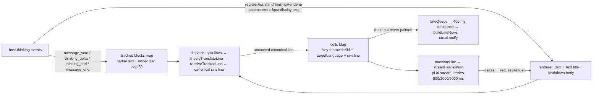

# Repository Guidelines

## Project Overview

`omp-thinking-translator` is a single-file [Oh My Pi](https://github.com/oh-my-pi) (omp) extension that renders a translated copy of each visible assistant *thinking* block underneath it in the TUI. Translation is **display-only and memory-only**: it is never written to the session file, model requests, or compaction input. Default target language is Simplified Chinese; the translator model is chosen by config (`{ provider, id }`) and resolved through the host model registry.

Package is `private` (not published to npm); it is installed into omp directly from git. `CLAUDE.md` holds two hard rules — keep `@oh-my-pi/*` on the latest release, and bump `package.json` `version` in every installable commit — read it before touching deps or committing.

## Architecture & Data Flow

Everything lives in `extensions/thinking-translator.ts` (default export `thinkingTranslator(api: ExtensionAPI)`); closure-scoped state, no classes.



Key invariants (deliberate; do not "simplify" them):

- **Host display text is the source of truth.** The renderer translates `context.text` (post-`formatThinkingForDisplay`), not raw event text. `tests/thinking-translator.test.ts:141-156` pins the host rewrite contract by importing the host source from `node_modules`.
- **Block matching is by content, not `contentIndex`, and yields the canonical raw line.** `matchBlockLine`/`resolveTrackedLine` accept a display line only when it is a *complete* line of a tracked block, tolerating host ellipsis/punctuation rewrites and rejecting a growing block's partial last line, and return the raw line it matched. The raw line — not the display variant — is the cell key and translation source: during the reveal a frame that lacks only the final period is also accepted, and keying by display text would translate that line twice (the first cell never gets painted and leaks into a late notify row). Index-based matching mis-attributes blocks across renderer rebuilds.
- **Per-line Latin gate.** `shouldTranslateLine` requires Latin chars to outnumber CJK chars.
- **Cache key** includes model and language so switching either invalidates; the cell map survives message boundaries so history still renders.
- **No placeholders.** Pending/empty rows are omitted; box title shows `done/total`; repaint via `context.requestRender`.
- **Late rows.** Cells finishing after the scrollback froze (typically at a tool call) go through `ctx.ui.notify`; payloads coalesce only while `chatContentGeneration` is unchanged, and generation advances only on `message_start`/`toolcall_start` — not on thinking deltas.
- **Each qualifying line streams independently**; no concurrency limit or per-block queue.
- **Config is loaded once per `message_start`**, replaced never cleared. `session_start`/`session_switch`/`session_shutdown` abort the shared `AbortController` and clear all state.
- **Failure policy.** Bad config JSON → warn once per path, force `enabled: false`. Model configured but absent from the registry → `refreshDiscoverableProviders([provider], "online")` (per-provider 60 s cooldown, `lastModelDiscoveryAt`), re-`find`; still absent → warn once per model key, roll the pending cells back so later renders retry after the cooldown. Stream/auth/empty response → 3 retries, then an `error` cell and one deduplicated warning. Aborts never become errors.

Host APIs relied on: `api.registerAssistantThinkingRenderer`, `api.registerCommand`, `api.on(...)` lifecycle/message events, `ctx.modelRegistry.find`, `ctx.modelRegistry.refreshDiscoverableProviders`, `getApiKeyAndHeaders`, `ctx.ui.notify`, `ctx.cwd`; `stream`/`Api`/`Model` from `@oh-my-pi/pi-ai`; `Box`/`Markdown`/`Text` from `@oh-my-pi/pi-tui`; `getMarkdownTheme` from `@oh-my-pi/pi-coding-agent`. The extension is omp-only (needs the thinking renderer hook); it does not run on plain pi.

## Key Directories

| Path | Purpose |
| --- | --- |
| `extensions/thinking-translator.ts` | The whole extension: state, renderer, dispatch, streaming, config, `/thinking-translator` command, `__testing` exports |
| `tests/thinking-translator.test.ts` | Unit tests over `__testing` pure helpers + one host contract test |
| `README.md` | User docs: install, config keys, pipeline, boundary evidence, limitations |
| `TODO.md` | Open work: display polish, non-LLM translation providers |
| `CLAUDE.md` | Dependency and version-bump policy (mandatory) |

No `src/`, no build output; the `.ts` file is loaded by omp as-is.

## Development Commands

```bash
pnpm install                      # pnpm is the package manager (no packageManager pin; pnpm 11 / bun 1.4 observed)
pnpm typecheck                    # tsc --noEmit on the single entry file; all flags on the CLI, no tsconfig
pnpm test                         # bun test tests/thinking-translator.test.ts
pnpm check                        # typecheck && test — the required gate before commit / install
bun test tests/thinking-translator.test.ts -t "config paths"   # single test by name substring

# Run against a live omp without installing
omp -e /absolute/path/to/extensions/thinking-translator.ts

# Install / refresh the plugin (bump package.json version first — see CLAUDE.md)
omp plugin install git:github.com/Mouriya-Emma/omp-thinking-translator
omp plugin list                   # confirm the displayed version matches package.json
```

In-app: `/thinking-translator status | init | init --global | init --project`. `init` writes a **disabled** template (`<agentDir>/thinking-translator.json` or `<cwd>/.omp/thinking-translator.json`) and refuses to overwrite.

Config precedence: defaults < global < project, merged per field (including `translatorModel` subfields). Keys: `enabled` (default `true`), `targetLanguage` (default `"Simplified Chinese"`), `translatorModel: { provider, id }` (required for any translation to happen).

## Code Conventions & Common Patterns

- **TypeScript ESM, strict-ish, no lint/format config** (no Biome/ESLint/Prettier, no tsconfig). Match the existing style by eye: 2-space indent, double quotes, trailing semicolons, `const` arrow/function declarations.
- **Closure-based module state**, not classes: `Map`s for cells/blocks, a `lateQueue`, timers (`unref`'d), one shared `AbortController`. Helpers are plain functions defined after the export.
- **Types over runtime checks inside; parse at the boundary.** Config JSON is read as `unknown` and normalized by `mergeConfig`/`normalizeTranslatorModel` into a resolved record. `TranslationProgress` is a discriminated union (`pending | streaming | done | error`); payloads are `Readonly`.
- **Pure helpers are test-exported** through the `__testing` object at the bottom of the file (`mergeConfig`, `shouldTranslateLine`, `matchBlockLine`, `resolveTrackedLine`, `splitTranslationLines`, `cellKey`, `cleanTranslation`, `buildLateRows`, config path helpers, `DEFAULT_CONFIG`). New pure logic goes there; new tests target those, not the extension lifecycle.
- **Errors are values or one-shot notifications.** Expected failures (bad config, missing model, exhausted retries) become state (`enabled:false`, `error` cell) plus a deduplicated `ctx.ui.notify`; nothing throws into the host. Credential lookup failures are wrapped in diagnostic `Error`s for retry handling.
- **Async: fire-and-forget per line**, streaming via `for await` over `pi-ai` events, redraw on every text delta, abort-aware (`signal.aborted` checks return early without erroring).
- **Prompting.** The translator prompt treats the source as inert data and forbids answering/summarizing/adding code; `cleanTranslation` strips code fences, `<thinking>`/`<text>` wrappers and the "原文保持不变" phrase. Keep both if you change the prompt.
- Comments in source/tests reference user-reported regressions (e.g. short-block, partial-line, coalescing); keep those tests green rather than rewriting them.

## Important Files

- `extensions/thinking-translator.ts` — entry point declared in `package.json` `omp.extensions`.
  - `~:9-100` types and module state; `~:101-151` renderer + command registration; `~:153-192` late-row queue/notify; `~:194-304` session/message hooks; `~:325-403` retry + streaming; `~:405-445` cache key and block matching; `~:463-615` config load/validate/init; `~:617-670` prompt and cleanup; `~:672-687` `__testing`.
- `package.json` — scripts, `omp.extensions` manifest, exact `@oh-my-pi/*` pins (`version` field = installed-plugin identity).
- `pnpm-workspace.yaml` — `allowBuilds: false` for native deps (`esbuild`, `sharp`, `koffi`, `onnxruntime-node`, …) and `minimumReleaseAgeExclude` for `@oh-my-pi/*`; update the version list there when bumping host deps.
- `tests/thinking-translator.test.ts:4` — direct import of `node_modules/@oh-my-pi/pi-coding-agent/src/utils/thinking-display.ts` (`formatThinkingForDisplay`).

## Runtime/Tooling Preferences

- **Runtime target is the user's installed omp** (Bun-based). Tests run under `bun test` using the `node:test`/`node:assert/strict` API. Typecheck uses `tsc` with `--moduleResolution bundler --module esnext --target es2024 --types node`; Node built-ins (`fs`, `os`, `path`) are used, no Bun-only APIs in the extension.
- **Package manager: pnpm** (`pnpm-lock.yaml` v9). Do not introduce `package-lock.json`/`bun.lockb`.
- **`@oh-my-pi/*` devDependencies must be exact and aligned to `dist-tags.latest`** (`CLAUDE.md`). If `pnpm check` fails after a bump because the host changed `formatThinkingForDisplay`, adapt the extension — never pin back.
- No CI (`.github/` absent); `pnpm check` is the only gate. No formatter; do not add one as part of unrelated work.
- Every commit that changes installable behavior must bump `package.json` `version` (minor for visible behavior, patch for fixes) and then be verified with `omp plugin install` + `omp plugin list`.

## Testing & QA

- Framework: Bun test runner executing `node:test` `test("<sentence>", …)` blocks with `node:assert/strict`; 23 flat tests, no `describe`, no mocks, no shared builders — inline literals only.
- Coverage: config paths and merge/validation, model normalization, Latin gating, complete-line/streaming block matching, cache key, translation cleanup/splitting, late-row payload building, and the host display-rewrite contract. **Not** covered: extension activation, live model calls, renderer/notify flow, config file I/O.
- Expectations: any change to a `__testing` helper or the block-matching/late-row rules gets a behavioral test in the same file; lifecycle/renderer changes are verified by running `omp -e …` against a real session and observing the box (`done/total` title) and late `notify` rows. Manual repro steps for the context-exclusion boundary live in `README.md` (~lines 149-174).
- Known limitations to keep in mind when judging "expected" behavior: folded/invisible blocks never render; scrollback freezes at the first tool call (late rows fall back to notify); no backfill on session reopen; identical lines share one translation per model+language; thinking lines are sent to the configured translator model (privacy note in README).
- Doc drift to be aware of: `README.md` still says `omp install …` (current CLI is `omp plugin install …`) and mentions 18.1.19 pins while `package.json` is on 18.1.21 — trust `package.json` and `CLAUDE.md`.
