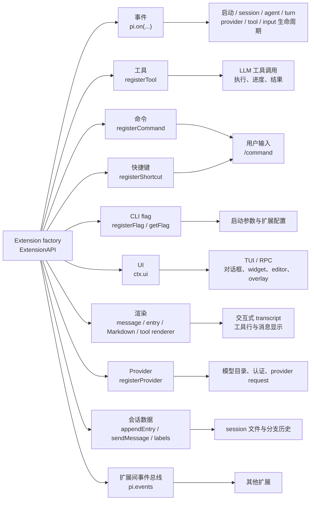

# Pi 扩展 API 面速查（0.85.1）

> **目标运行时。** 本文针对本机全局安装的 Pi `0.85.1`。版本证据是官方安装目录的 `package.json:3`。
>
> **证据路径约定。** 本文中写成 `dist/...:行号` 的路径，统一相对于
> `/opt/homebrew/lib/node_modules/@earendil-works/pi-coding-agent/`；例如
> `dist/core/extensions/types.d.ts:906-1084` 实际指向该目录下的文件。官方文档引用写成
> `docs/extensions.md §小节名`。少量版本对比明确写出仓库本地旧包的绝对路径：
> `/Users/mouriya/Ext/code/pi-thinking-translator/node_modules/@earendil-works/pi-coding-agent/`
> （`0.75.3`）。
>
> **本文和官方文档的分工。** 官方文档完整、会随 Pi 升版变化；本文是针对 `0.85.1`、每个公开
> `ExtensionAPI` 成员带声明证据的中文速查表。事件时序、上下文投影、持久化和 compaction 的深入
> 边界见同目录的 [`pi-extension-events.md`](./pi-extension-events.md)；完整开发步骤和已运行示例
> 见 [`extension-development-guide.md`](./extension-development-guide.md)。本文不复制那两篇的
> 专题表格。
>
> **本机资料位置。** 官方资料在
> `/opt/homebrew/lib/node_modules/@earendil-works/pi-coding-agent/docs/`（重点是
> `extensions.md`、`tui.md`、`custom-provider.md`、`packages.md`），官方示例在
> `/opt/homebrew/lib/node_modules/@earendil-works/pi-coding-agent/examples/extensions/`。

## 能力全景



上图中的“事件”是宿主运行时接入点；“工具”进入模型可调用的工具集合；“命令”和“快捷键”
进入用户操作面；“flag”在 CLI 启动面；`ctx.ui` 和 renderer 进入交互式显示面；provider 进入
模型请求面；`appendEntry` 等进入会话文件面。能力名称与官方摘要相符，见
`docs/extensions.md §Extensions` 和 `§Available Imports`。

## 版本基线与差异

当前声明的完整 `ExtensionAPI` 接口位于 `dist/core/extensions/types.d.ts:906-1084`。
我逐成员对照了仓库本地的
`/Users/mouriya/Ext/code/pi-thinking-translator/node_modules/@earendil-works/pi-coding-agent/dist/core/extensions/types.d.ts:783-937`
（`0.75.3`），因此下方的“0.75.3”列不是根据 `peerDependencies` 推断的。

`0.85.1` 还改变了若干被方法使用的类型：`ExtensionContext` 增加 `mode`、
`scopedModels`、`thinkingLevel`、`isProjectTrusted`（`dist/core/extensions/types.d.ts:209-249`；旧声明
`/Users/mouriya/Ext/code/pi-thinking-translator/node_modules/@earendil-works/pi-coding-agent/dist/core/extensions/types.d.ts:207-236`）；`ToolDefinition` 增加 `constrainedSampling`（`dist/core/extensions/types.d.ts:344-377`；
旧声明 `/Users/mouriya/Ext/code/pi-thinking-translator/node_modules/@earendil-works/pi-coding-agent/dist/core/extensions/types.d.ts:328-359`）；`MessageRenderOptions` 增加 `outputPad`
（`dist/core/extensions/types.d.ts:875-890`；旧声明 `/Users/mouriya/Ext/code/pi-thinking-translator/node_modules/@earendil-works/pi-coding-agent/dist/core/extensions/types.d.ts:764-767`）；`ProviderConfig` 增加
`refreshModels`，并扩充 OAuth 回调字段（`dist/core/extensions/types.d.ts:1086-1130`；旧声明
`/Users/mouriya/Ext/code/pi-thinking-translator/node_modules/@earendil-works/pi-coding-agent/dist/core/extensions/types.d.ts:938-969`）。

## `ExtensionAPI` 方法全表

以下表格按 `ExtensionAPI` 声明顺序列出每个成员；`on` 的每一个事件 overload 都单独列出。
签名保留当前声明中的类型名和泛型。示例栏给出官方示例文件名；官方没有针对某个通知型 hook
提供专门示例时，明确写“无专门示例”，不把相邻示例冒充为该 hook 的实现。

### 事件订阅：`pi.on`

| 精确签名 | 用途与关键限制 | 0.75.3 | 声明证据；官方示例 |
|---|---|---|---|
| `on(event: "project_trust", handler: ProjectTrustHandler): void;` | 在项目动态配置加载前参与信任决策；返回 `trusted: "yes" \| "no" \| "undecided"`。只有 user/global 或 CLI 扩展参与，且 trust context 是受限的。 | 无 | `dist/core/extensions/types.d.ts:907`；`docs/extensions.md §project_trust`；`examples/extensions/project-trust.ts` |
| `on(event: "resources_discover", handler: ExtensionHandler<ResourcesDiscoverEvent, ResourcesDiscoverResult>): void;` | 在 `session_start` 后贡献 skill、prompt、theme 路径；返回值是对应路径数组，原因是 `"startup" \| "reload"`。 | 有 | `dist/core/extensions/types.d.ts:908`；`docs/extensions.md §resources_discover`；`examples/extensions/dynamic-resources/index.ts` |
| `on(event: "session_start", handler: ExtensionHandler<SessionStartEvent>): void;` | 会话启动、恢复、新建、fork 或 reload 后初始化内存状态和 UI；通过 `event.reason` 区分原因。 | 有 | `dist/core/extensions/types.d.ts:909`；`docs/extensions.md §session_start`；`examples/extensions/status-line.ts` |
| `on(event: "session_info_changed", handler: ExtensionHandler<SessionInfoChangedEvent>): void;` | `/name`、RPC 或 `pi.setSessionName()` 改变显示名称时通知扩展。 | 无 | `dist/core/extensions/types.d.ts:910`；`docs/extensions.md §session_info_changed`；`examples/extensions/session-name.ts`（使用名称 API，未订阅此事件） |
| `on(event: "session_before_switch", handler: ExtensionHandler<SessionBeforeSwitchEvent, SessionBeforeSwitchResult>): void;` | `/new` 或 `/resume` 前置拦截；返回 `{ cancel: true }` 可取消切换。 | 有 | `dist/core/extensions/types.d.ts:911`；`docs/extensions.md §session_before_switch`；`examples/extensions/confirm-destructive.ts` |
| `on(event: "session_before_fork", handler: ExtensionHandler<SessionBeforeForkEvent, SessionBeforeForkResult>): void;` | `/fork` 或 `/clone` 前置拦截；可取消，也可返回 `skipConversationRestore`。 | 有 | `dist/core/extensions/types.d.ts:912`；`docs/extensions.md §session_before_fork`；`examples/extensions/confirm-destructive.ts` |
| `on(event: "session_before_compact", handler: ExtensionHandler<SessionBeforeCompactEvent, SessionBeforeCompactResult>): void;` | compaction 前置 hook；可取消，或返回 `compaction` 整体替换默认摘要。深入投影规则见 [`pi-extension-events.md`](./pi-extension-events.md)。 | 有 | `dist/core/extensions/types.d.ts:913`；`docs/extensions.md §session_before_compact / session_compact / session_compact_failed`；`examples/extensions/custom-compaction.ts` |
| `on(event: "session_compact", handler: ExtensionHandler<SessionCompactEvent>): void;` | compaction 成功后的通知，事件带保存的 `compactionEntry` 和 `fromExtension`。 | 有 | `dist/core/extensions/types.d.ts:914`；`docs/extensions.md §session_compact / session_compact_failed`；`examples/extensions/custom-compaction.ts`（只实现前置 hook） |
| `on(event: "session_compact_failed", handler: ExtensionHandler<SessionCompactFailedEvent>): void;` | compaction 失败或中止后的通知，事件区分 `aborted`、错误文本和是否会重试。 | 无 | `dist/core/extensions/types.d.ts:915`；`docs/extensions.md §session_compact / session_compact_failed`；无专门示例 |
| `on(event: "session_shutdown", handler: ExtensionHandler<SessionShutdownEvent>): void;` | 当前扩展运行时关闭前清理 session-scoped 进程、socket、watcher、timer 等资源。 | 有 | `dist/core/extensions/types.d.ts:916`；`docs/extensions.md §session_shutdown`；`examples/extensions/auto-commit-on-exit.ts` |
| `on(event: "session_before_tree", handler: ExtensionHandler<SessionBeforeTreeEvent, SessionBeforeTreeResult>): void;` | `/tree` 导航前置 hook；可取消或提供 branch summary。 | 有 | `dist/core/extensions/types.d.ts:917`；`docs/extensions.md §session_before_tree / session_tree`；无专门示例 |
| `on(event: "session_tree", handler: ExtensionHandler<SessionTreeEvent>): void;` | `/tree` 导航完成后的通知，可据此从当前分支重建状态。 | 有 | `dist/core/extensions/types.d.ts:918`；`docs/extensions.md §session_before_tree / session_tree`；`examples/extensions/tools.ts` |
| `on(event: "context", handler: ExtensionHandler<ContextEvent, ContextEventResult>): void;` | 每次 LLM call 前修改消息数组；返回 `{ messages }` 替换本次 provider 输入。它不是对会话文件的持久化写操作。 | 有 | `dist/core/extensions/types.d.ts:919`；`docs/extensions.md §context`；`examples/extensions/plan-mode/index.ts` |
| `on(event: "before_provider_request", handler: ExtensionHandler<BeforeProviderRequestEvent, BeforeProviderRequestEventResult>): void;` | provider payload 已构造、发送前查看或替换 payload；返回 `undefined` 保留原值，其他值替换给后续 handler 和请求。 | 有 | `dist/core/extensions/types.d.ts:920`；`docs/extensions.md §before_provider_request`；`examples/extensions/provider-payload.ts` |
| `on(event: "before_provider_headers", handler: ExtensionHandler<BeforeProviderHeadersEvent>): void;` | HTTP 请求前修改 `event.headers`；赋字符串新增/覆盖，赋 `null` 删除；返回值忽略。 | 无 | `dist/core/extensions/types.d.ts:921`；`docs/extensions.md §before_provider_headers`；无专门示例 |
| `on(event: "after_provider_response", handler: ExtensionHandler<AfterProviderResponseEvent>): void;` | 收到 provider 响应、消费 body 前查看 HTTP status 和规范化 headers。 | 有 | `dist/core/extensions/types.d.ts:922`；`docs/extensions.md §after_provider_response`；`examples/extensions/provider-payload.ts` |
| `on(event: "before_agent_start", handler: ExtensionHandler<BeforeAgentStartEvent, BeforeAgentStartEventResult>): void;` | 用户提交 prompt 后、agent loop 前注入持久 custom message 或替换本轮 system prompt；多个扩展的 system prompt 修改会链式传递。 | 有 | `dist/core/extensions/types.d.ts:923`；`docs/extensions.md §before_agent_start`；`examples/extensions/pirate.ts` |
| `on(event: "agent_start", handler: ExtensionHandler<AgentStartEvent>): void;` | 一次底层 agent run 开始时通知。若要等所有自动 retry、compaction retry 和 queued continuation 结束，应使用 `agent_settled`。 | 有 | `dist/core/extensions/types.d.ts:924`；`docs/extensions.md §agent_start / agent_end / agent_settled`；`examples/extensions/system-prompt-header.ts` |
| `on(event: "agent_end", handler: ExtensionHandler<AgentEndEvent>): void;` | 一次底层 run 结束时通知；此时 Pi 仍可能自动 retry、compact 或继续处理队列。 | 有 | `dist/core/extensions/types.d.ts:925`；`docs/extensions.md §agent_start / agent_end / agent_settled`；`examples/extensions/git-merge-and-resolve.ts` |
| `on(event: "agent_settled", handler: ExtensionHandler<AgentSettledEvent>): void;` | 整个 agent 运行已经没有自动 retry、compaction 或 queued continuation 时通知；适合“真正完成”状态集成。 | 无 | `dist/core/extensions/types.d.ts:926`；`docs/extensions.md §agent_start / agent_end / agent_settled`；`examples/extensions/titlebar-spinner.ts` |
| `on(event: "ui_prompt_start", handler: ExtensionHandler<UIPromptStartEvent>): void;` | blocking extension UI prompt 开始时的通知型 hook；嵌套 prompt 会合并成一个外层等待区间。 | 无 | `dist/core/extensions/types.d.ts:927`；`docs/extensions.md §ui_prompt_start / ui_prompt_end`；无专门示例 |
| `on(event: "ui_prompt_end", handler: ExtensionHandler<UIPromptEndEvent>): void;` | blocking extension UI prompt 等待结束时的通知型 hook；handler 不阻塞 prompt 的显示/关闭。 | 无 | `dist/core/extensions/types.d.ts:928`；`docs/extensions.md §ui_prompt_start / ui_prompt_end`；无专门示例 |
| `on(event: "turn_start", handler: ExtensionHandler<TurnStartEvent>): void;` | 每个“一个 LLM response 加其工具调用”的 turn 开始时通知。 | 有 | `dist/core/extensions/types.d.ts:929`；`docs/extensions.md §turn_start / turn_end`；`examples/extensions/status-line.ts` |
| `on(event: "turn_end", handler: ExtensionHandler<TurnEndEvent>): void;` | 一个 turn 结束时通知，事件带最终消息和 tool results。 | 有 | `dist/core/extensions/types.d.ts:930`；`docs/extensions.md §turn_start / turn_end`；`examples/extensions/status-line.ts` |
| `on(event: "message_start", handler: ExtensionHandler<MessageStartEvent>): void;` | user、assistant、toolResult 消息开始时通知。 | 有 | `dist/core/extensions/types.d.ts:931`；`docs/extensions.md §message_start / message_update / message_end`；无专门示例 |
| `on(event: "message_update", handler: ExtensionHandler<MessageUpdateEvent>): void;` | assistant 消息流式更新时通知，带 `assistantMessageEvent`；不是 user/toolResult 的通用更新 hook。 | 有 | `dist/core/extensions/types.d.ts:932`；`docs/extensions.md §message_start / message_update / message_end`；无专门示例 |
| `on(event: "message_end", handler: ExtensionHandler<MessageEndEvent, MessageEndEventResult>): void;` | 消息结束时通知；可返回替换消息，但 replacement 必须保持原 `role`。 | 有 | `dist/core/extensions/types.d.ts:933`；`docs/extensions.md §message_start / message_update / message_end`；无专门示例 |
| `on(event: "tool_execution_start", handler: ExtensionHandler<ToolExecutionStartEvent>): void;` | 工具开始执行时通知，带 tool call id、名称和参数。并行工具模式下 start 按 assistant source order preflight。 | 有 | `dist/core/extensions/types.d.ts:934`；`docs/extensions.md §tool_execution_start / tool_execution_update / tool_execution_end`；无专门示例 |
| `on(event: "tool_execution_update", handler: ExtensionHandler<ToolExecutionUpdateEvent>): void;` | 工具执行中的 partial result 通知；并行模式下不同工具的 update 可以交错。 | 有 | `dist/core/extensions/types.d.ts:935`；`docs/extensions.md §tool_execution_start / tool_execution_update / tool_execution_end`；无专门示例 |
| `on(event: "tool_execution_end", handler: ExtensionHandler<ToolExecutionEndEvent>): void;` | 工具执行完成通知，带结果和 `isError`；并行模式下按完成顺序发出。 | 有 | `dist/core/extensions/types.d.ts:936`；`docs/extensions.md §tool_execution_start / tool_execution_update / tool_execution_end`；无专门示例 |
| `on(event: "model_select", handler: ExtensionHandler<ModelSelectEvent>): void;` | 模型通过 `/model`、循环选择或 session restore 变化时通知；事件带新旧模型和 source。 | 有 | `dist/core/extensions/types.d.ts:937`；`docs/extensions.md §model_select`；`examples/extensions/model-status.ts` |
| `on(event: "thinking_level_select", handler: ExtensionHandler<ThinkingLevelSelectEvent>): void;` | thinking level 变化时通知；handler 返回值忽略。 | 有 | `dist/core/extensions/types.d.ts:938`；`docs/extensions.md §thinking_level_select`；无专门示例 |
| `on(event: "tool_call", handler: ExtensionHandler<ToolCallEvent, ToolCallEventResult>): void;` | 工具执行前拦截；可原地修改 `event.input` 或返回 `{ block: true, reason?, terminate? }`。修改后不重新校验。 | 有 | `dist/core/extensions/types.d.ts:939`；`docs/extensions.md §tool_call`；`examples/extensions/permission-gate.ts` |
| `on(event: "tool_result", handler: ExtensionHandler<ToolResultEvent, ToolResultEventResult>): void;` | 工具完成后、最终 toolResult message events 前作 middleware；可 patch `content`、`details`、`isError`、`usage`。 | 有 | `dist/core/extensions/types.d.ts:940`；`docs/extensions.md §tool_result`；`examples/extensions/git-checkpoint.ts` |
| `on(event: "user_bash", handler: ExtensionHandler<UserBashEvent, UserBashEventResult>): void;` | 用户执行 `!` / `!!` 时接管 bash；可返回自定义 `operations` 或完整 `result`。 | 有 | `dist/core/extensions/types.d.ts:941`；`docs/extensions.md §user_bash`；`examples/extensions/interactive-shell.ts` |
| `on(event: "input", handler: ExtensionHandler<InputEvent, InputEventResult>): void;` | extension command 检查后、skill/template 展开前拦截输入；结果为 `continue`、`transform` 或 `handled`。 | 有 | `dist/core/extensions/types.d.ts:942`；`docs/extensions.md §input`；`examples/extensions/input-transform.ts` |

事件 handler 的统一类型是 `ExtensionHandler<E, R> = (event: E, ctx: ExtensionContext) => Promise<R | void> | R | void`
（`dist/core/extensions/types.d.ts:901-902`）。事件的完整时序和 compaction/context 边界不要从这张
API 表推断，见 [`pi-extension-events.md`](./pi-extension-events.md)。

### 注册、会话、工具、provider 和总线方法

| 精确签名 | 用途与关键限制 | 0.75.3 | 声明证据；官方示例 |
|---|---|---|---|
| `registerTool<TParams extends TSchema = TSchema, TDetails = unknown, TState = any>(tool: ToolDefinition<TParams, TDetails, TState>): void;` | 注册 LLM 可调用工具；工具是否实际暴露由 active-tools 集合决定。`ToolDefinition` 详见下文。 | 有（`ToolDefinition` 新增 `constrainedSampling`） | `dist/core/extensions/types.d.ts:943-944`；`docs/extensions.md §ExtensionAPI Methods / Custom Tools`；`examples/extensions/hello.ts` |
| `registerCommand(name: string, options: Omit<RegisteredCommand, "name" \| "sourceInfo">): void;` | 注册 `/name` 命令；重复名字不会互相覆盖，而按加载顺序分配 `:1`、`:2` 等调用后缀。 | 有 | `dist/core/extensions/types.d.ts:945-946`；`docs/extensions.md §pi.registerCommand(name, options)`；`examples/extensions/commands.ts` |
| `registerShortcut(shortcut: KeyId, options: { description?: string; handler: (ctx: ExtensionContext) => Promise<void> \| void; }): void;` | 注册键盘快捷键；handler 收到普通 `ExtensionContext`，不是 command context。 | 有 | `dist/core/extensions/types.d.ts:947-951`；`docs/extensions.md §pi.registerShortcut(shortcut, options)`；`examples/extensions/preset.ts` |
| `registerFlag(name: string, options: { description?: string; type: "boolean"; default?: boolean; } \| { description?: string; type: "string"; default?: string; }): void;` | 注册扩展 CLI flag；boolean 和 string 是区分开的对象形状，默认值类型必须匹配。 | 有（旧声明是未区分的 `type: "boolean" \| "string"` 联合） | `dist/core/extensions/types.d.ts:952-961`；`docs/extensions.md §pi.registerFlag(name, options)`；`examples/extensions/ssh.ts` |
| `getFlag(name: string): boolean \| string \| undefined;` | 读取注册 flag 的解析值；未注册或未提供且无默认值时为 `undefined`。 | 有 | `dist/core/extensions/types.d.ts:962-963`；`docs/extensions.md §pi.registerFlag(name, options)`；`examples/extensions/ssh.ts` |
| `registerMessageRenderer<T = unknown>(customType: string, renderer: MessageRenderer<T>): void;` | 给 `pi.sendMessage()` 创建的 custom message 注册 TUI renderer；消息仍参加 LLM context。 | 有（`MessageRenderOptions` 新增 `outputPad`） | `dist/core/extensions/types.d.ts:964-965`；`docs/extensions.md §pi.registerMessageRenderer(customType, renderer)`；`examples/extensions/message-renderer.ts` |
| `registerMarkdownTransformer(transformer: MarkdownTransformer): void;` | 在 Pi 内置 Markdown renderer 前同步转换 user、assistant 和 thinking Markdown；只改变显示文本，不改变 session/context。 | 无 | `dist/core/extensions/types.d.ts:966-967`；`docs/extensions.md §pi.registerMarkdownTransformer(transformer)`；无专门示例 |
| `registerEntryRenderer<T = unknown>(customType: string, renderer: EntryRenderer<T>): void;` | 给 `pi.appendEntry()` 创建的 custom entry 注册 TUI renderer；custom entry 不参加 LLM context。 | 无 | `dist/core/extensions/types.d.ts:968-969`；`docs/extensions.md §pi.registerEntryRenderer(customType, renderer)`；`examples/extensions/entry-renderer.ts` |
| `sendMessage<T = unknown>(message: Pick<CustomMessage<T>, "customType" \| "content" \| "display" \| "details">, options?: { triggerTurn?: boolean; deliverAs?: "steer" \| "followUp" \| "nextTurn"; }): void;` | 写入 custom message；参加 LLM context。streaming 时用 `deliverAs` 选择 steer/follow-up/next-turn；没有返回 entry id。 | 有 | `dist/core/extensions/types.d.ts:970-974`；`docs/extensions.md §pi.sendMessage(message, options?)`；`examples/extensions/file-trigger.ts` |
| `sendUserMessage(content: string \| (TextContent \| ImageContent)[], options?: { deliverAs?: "steer" \| "followUp"; expandPromptTemplates?: boolean; }): void;` | 写入真实 user message 且总会触发一轮；streaming 时必须选 delivery mode；`expandPromptTemplates` 才会启用 extension command 和 skill/prompt 展开。 | 有（旧签名没有 `expandPromptTemplates`） | `dist/core/extensions/types.d.ts:975-983`；`docs/extensions.md §pi.sendUserMessage(content, options?)`；`examples/extensions/send-user-message.ts` |
| `appendEntry<T = unknown>(customType: string, data?: T): void;` | 持久化扩展数据；custom entry 不发给 LLM，可配 `registerEntryRenderer` 显示。 | 有 | `dist/core/extensions/types.d.ts:984-985`；`docs/extensions.md §pi.appendEntry(customType, data?)`；`examples/extensions/entry-renderer.ts` |
| `setSessionName(name: string): void;` | 设置 session selector 使用的显示名称。 | 有 | `dist/core/extensions/types.d.ts:986-987`；`docs/extensions.md §pi.setSessionName(name)`；`examples/extensions/session-name.ts` |
| `getSessionName(): string \| undefined;` | 读取当前 session 显示名称。 | 有 | `dist/core/extensions/types.d.ts:988-989`；`docs/extensions.md §pi.getSessionName()`；`examples/extensions/session-name.ts` |
| `setLabel(entryId: string, label: string \| undefined): void;` | 在已有 entry 上设置或清除 bookmark/navigation label；读取用 `ctx.sessionManager.getLabel()`。 | 有 | `dist/core/extensions/types.d.ts:990-991`；`docs/extensions.md §pi.setLabel(entryId, label)`；`examples/extensions/bookmark.ts` |
| `exec(command: string, args: string[], options?: ExecOptions): Promise<ExecResult>;` | 执行 shell command，结果含 `stdout`、`stderr`、`code`、`killed`；应把 abort signal/timeout 传给可取消的工作。 | 有 | `dist/core/extensions/types.d.ts:992-993`；`docs/extensions.md §pi.exec(command, args, options?)`；`examples/extensions/auto-commit-on-exit.ts` |
| `getActiveTools(): string[];` | 读取当前实际暴露给模型的工具名。 | 有 | `dist/core/extensions/types.d.ts:994-995`；`docs/extensions.md §pi.getActiveTools() / pi.getAllTools() / pi.setActiveTools(names)`；`examples/extensions/tools.ts` |
| `getAllTools(): ToolInfo[];` | 读取所有已配置工具的 name、description、parameters、promptGuidelines 和 source metadata，不等同于 active 集合。 | 有 | `dist/core/extensions/types.d.ts:996-997`；`docs/extensions.md §pi.getActiveTools() / pi.getAllTools() / pi.setActiveTools(names)`；`examples/extensions/dynamic-tools.ts` |
| `setActiveTools(toolNames: string[]): void;` | 按名称切换 active tools；名称必须已注册，未知名称忽略。纯 additive 变更可触发 dynamic tool loading。 | 有 | `dist/core/extensions/types.d.ts:998-999`；`docs/extensions.md §Dynamic Tool Loading`；`examples/extensions/tools.ts` |
| `getCommands(): SlashCommandInfo[];` | 返回当前可由 `prompt` 调用的 extension、prompt template、skill commands；内置 interactive commands 不在列表中。 | 有 | `dist/core/extensions/types.d.ts:1000-1001`；`docs/extensions.md §pi.getCommands()`；`examples/extensions/commands.ts` |
| `setModel(model: Model<any>): Promise<boolean>;` | 切换当前 session 模型并记录到 session；不改新 session 默认值；没有 provider authentication 时返回 `false`。 | 有 | `dist/core/extensions/types.d.ts:1002-1006`；`docs/extensions.md §pi.setModel(model)`；`examples/extensions/handoff.ts` |
| `getThinkingLevel(): ThinkingLevel;` | 读取当前 thinking level。 | 有 | `dist/core/extensions/types.d.ts:1007-1008`；`docs/extensions.md §pi.getThinkingLevel() / pi.setThinkingLevel(level)`；`examples/extensions/preset.ts` |
| `setThinkingLevel(level: ThinkingLevel): void;` | 设置当前 session thinking level；会按模型能力 clamp，不改变新 session 默认值，并触发 `thinking_level_select`。 | 有 | `dist/core/extensions/types.d.ts:1009-1013`；`docs/extensions.md §pi.getThinkingLevel() / pi.setThinkingLevel(level)`；`examples/extensions/preset.ts` |
| `registerProvider(provider: Provider): void;` | 注册完整的 pi-ai `Provider`，可自定义 auth、model refresh/filter、stream 等行为。此 overload 是 `0.85.1` 新增。 | 无 | `dist/core/extensions/types.d.ts:1015-1066`；`docs/custom-provider.md §Quick Reference / Register New Provider`；`examples/extensions/custom-provider-anthropic/index.ts` |
| `registerProvider(name: string, config: ProviderConfig): void;` | 以 legacy config 形式新增或覆盖 provider；初始 factory 调用排队，runner bind 后应用，之后调用立即生效。 | 有 | `dist/core/extensions/types.d.ts:1015-1067`；`docs/extensions.md §pi.registerProvider(name, config)`；`examples/extensions/custom-provider-anthropic/index.ts` |
| `unregisterProvider(name: string): void;` | 移除扩展注册的 provider 和模型，并恢复被覆盖的内置模型；未注册时无效果。 | 有 | `dist/core/extensions/types.d.ts:1068-1081`；`docs/extensions.md §pi.unregisterProvider(name)`；无专门示例（官方 provider 文档有注销片段） |
| `events: EventBus;` | 扩展间共享事件总线；用 `pi.events.on(name, handler)` 订阅、`pi.events.emit(name, data)` 发布。 | 有 | `dist/core/extensions/types.d.ts:1082-1083`；`docs/extensions.md §pi.events`；`examples/extensions/event-bus.ts` |

### 注册记录类型

这些类型不是额外的 `pi.*` 方法，但决定上述注册参数的形状：

| 类型 | 当前形状 | 证据 |
|---|---|---|
| `RegisteredCommand` | `name: string`、`sourceInfo: SourceInfo`、可选 `description`、可选 `getArgumentCompletions(argumentPrefix)`、`handler(args: string, ctx: ExtensionCommandContext): Promise<void>`。调用 `registerCommand` 时由 `Omit` 隐去 `name`/`sourceInfo`。 | `dist/core/extensions/types.d.ts:891-897` |
| `ExtensionFlag` | `name: string`、可选 `description`、`type: "boolean" \| "string"`、可选匹配类型的 `default`、内部 `extensionPath`。 | `dist/core/extensions/types.d.ts:1171-1177` |
| `ExtensionShortcut` | `shortcut: KeyId`、可选 `description`、`handler(ctx: ExtensionContext): Promise<void> \| void`、内部 `extensionPath`。 | `dist/core/extensions/types.d.ts:1178-1183` |

## `ExtensionContext` 与 `ExtensionCommandContext`

`ExtensionCommandContext extends ExtensionContext`；普通事件 handler、tool `execute`、shortcut
handler 都拿普通 context。命令专属 session control 只放到 command context，因为在事件 handler
中使用它们可能 deadlock（`docs/extensions.md §ExtensionCommandContext`）。

### 普通 `ExtensionContext`

| 字段/方法 | 精确类型 | 实际用法与边界 |
|---|---|---|
| `ui` | `ExtensionUIContext` | 通过 `ctx.ui` 进入对话框、通知、widget、editor 和 custom component；完整表见下一节。声明：`dist/core/extensions/types.d.ts:210-211`。 |
| `mode` | `ExtensionMode`，即 `"tui" \| "rpc" \| "json" \| "print"` | 用 `ctx.mode === "tui"` 守卫 terminal-only component、raw terminal input 和直接 TUI renderer。声明：`dist/core/extensions/types.d.ts:208,212-213`；模式说明：`docs/extensions.md §Mode Behavior`。此字段在 0.75.3 不存在。 |
| `hasUI` | `boolean` | `true` 是 TUI/RPC，`false` 是 JSON/print；在 dialog 和 fire-and-forget UI 前检查。不要把 RPC 当作 `hasUI=false`：RPC 有 UI protocol，但不支持所有 TUI 能力。声明：`dist/core/extensions/types.d.ts:214-215`；`docs/extensions.md §ctx.hasUI`。 |
| `cwd` | `string` | 当前工作目录；构造项目配置路径应使用导出的 `CONFIG_DIR_NAME`，而不是硬编码 `.pi`。声明：`dist/core/extensions/types.d.ts:216-217`；`docs/extensions.md §ctx.cwd`。 |
| `sessionManager` | `ReadonlySessionManager` | 只读查看会话：`getEntries()` 全部 entries、`getBranch()` 当前分支、`buildContextEntries()` 应用 compaction 后的 context entries、`getLeafId()` 当前 leaf。`tool_call` 前已同步至当前 assistant message，但并行 sibling 的 tool result 不保证已出现。声明：`dist/core/extensions/types.d.ts:218-219`；`docs/extensions.md §ctx.sessionManager`。 |
| `modelRegistry` | `ModelRegistry` | 查 provider/model 和认证；`getProvider(id)` 取 effective pi-ai provider，`getProviderAuth(id)` 解析当前 key、headers、base URL 和 provider env，即使没有 loaded model 也可用。声明：`dist/core/extensions/types.d.ts:220-221`；`docs/extensions.md §ctx.modelRegistry / ctx.model / ctx.thinkingLevel / ctx.scopedModels`。 |
| `model` | `Model<any> \| undefined` | 当前活动模型；启动或尚未选择模型时可能是 `undefined`。声明：`dist/core/extensions/types.d.ts:222-223`。 |
| `scopedModels` | `readonly ScopedModel[]` | 当前 session 的模型 scope 快照，和 `/scoped-models` 相同；由 `--models`/`enabledModels` 解析，未配置 scope 时为空。声明：`dist/core/extensions/types.d.ts:224-228`；`docs/extensions.md §ctx.modelRegistry / ctx.model / ctx.thinkingLevel / ctx.scopedModels`。此字段在 0.75.3 不存在。 |
| `thinkingLevel` | `ThinkingLevel \| undefined` | 当前有效 thinking level；在 session runtime 提供时存在。声明：`dist/core/extensions/types.d.ts:229-230`。此字段在 0.75.3 不存在。 |
| `isIdle()` | `() => boolean` | 判断 Pi 是否没有 agent run、自动 retry、auto-compaction retry 或 queued continuation；这些过程中的 `isIdle()` 都是 `false`。声明：`dist/core/extensions/types.d.ts:231-232`；`docs/extensions.md §ctx.isIdle() / ctx.abort() / ctx.hasPendingMessages()`。 |
| `isProjectTrusted()` | `() => boolean` | 判断当前 session context 是否有项目级 trust，包括临时 trust 和 CLI override；读取应受 trust 保护的项目配置前调用。声明：`dist/core/extensions/types.d.ts:233-234`；`docs/extensions.md §ctx.isProjectTrusted`。此方法在 0.75.3 不存在。 |
| `signal` | `AbortSignal \| undefined` | agent turn 活跃时通常有 signal，idle、session event、command、idle shortcut 通常是 `undefined`；把它传给 `fetch`、模型调用、文件/进程 helper，以便 Esc 取消嵌套工作。声明：`dist/core/extensions/types.d.ts:235-236`；`docs/extensions.md §ctx.signal`。 |
| `abort()` | `() => void` | 请求中止当前 agent operation；无参数。它不同于只取消扩展自己启动的一个 `fetch`。声明：`dist/core/extensions/types.d.ts:237-238`；`docs/extensions.md §ctx.isIdle() / ctx.abort() / ctx.hasPendingMessages()`。 |
| `hasPendingMessages()` | `() => boolean` | 查看是否有排队消息等待交付。声明：`dist/core/extensions/types.d.ts:239-240`。 |
| `shutdown()` | `() => void` | 请求 graceful shutdown；interactive/RPC 会等到合适的 idle 边界，print 是 no-op，并在退出前发 `session_shutdown`。声明：`dist/core/extensions/types.d.ts:241-242`；`docs/extensions.md §ctx.shutdown`。 |
| `getContextUsage()` | `() => ContextUsage \| undefined` | 取当前模型 context 使用量；优先使用最近 assistant usage，否则估算尾部消息。`ContextUsage` 是 `{ tokens: number \| null; contextWindow: number; percent: number \| null }`，compaction 后 token 未知时可为 `null`。声明：`dist/core/extensions/types.d.ts:193-198,243-244`；`docs/extensions.md §ctx.getContextUsage`。 |
| `compact(options?: CompactOptions)` | `(options?: CompactOptions) => void` | fire-and-forget 触发 compaction；用 `customInstructions`、`onComplete`、`onError` 接结果，不能等待其返回值。声明：`dist/core/extensions/types.d.ts:200-203,245-246`；`docs/extensions.md §ctx.compact`。 |
| `getSystemPrompt()` | `() => string` | 取当前 effective system prompt；在 `before_agent_start` 反映已链式修改，但不含后续 `context` message 变更或 `before_provider_request` payload rewrite。声明：`dist/core/extensions/types.d.ts:247-248`；`docs/extensions.md §ctx.getSystemPrompt`。 |

### 命令专属的 `ExtensionCommandContext`

| 精确成员 | 实际用法与边界 |
|---|---|
| `getSystemPromptOptions(): BuildSystemPromptOptions` | 读取当前构造 system prompt 的 base inputs（custom prompt、active tools、tool snippets、guidelines、context files、skills 等）；不含 per-turn chained prompt、后续 context mutations 或 provider payload rewrites。声明：`dist/core/extensions/types.d.ts:254-256`；`docs/extensions.md §ctx.getSystemPromptOptions`。0.75.3 没有此方法。 |
| `waitForIdle(): Promise<void>` | 命令里等待 agent 完全 settle，包含自动 retry、auto-compaction retry 和 queued continuation，然后再修改 session。声明：`dist/core/extensions/types.d.ts:257-258`；`docs/extensions.md §ctx.waitForIdle`。 |
| `newSession(options?: { parentSession?: string; setup?: (sessionManager: SessionManager) => Promise<void>; withSession?: (ctx: ReplacedSessionContext) => Promise<void> }): Promise<{ cancelled: boolean }>` | 新建 session；`setup` 可在切换前操作新 `SessionManager`，`withSession` 收到绑定到新 session 的 context。声明：`dist/core/extensions/types.d.ts:259-266`；`docs/extensions.md §ctx.newSession`。 |
| `fork(entryId: string, options?: { position?: "before" \| "at"; withSession?: (ctx: ReplacedSessionContext) => Promise<void> }): Promise<{ cancelled: boolean }>` | 从 entry fork；`position` 决定 `before`/`at` 语义；取消由 `session_before_fork` 反映。声明：`dist/core/extensions/types.d.ts:267-273`；`docs/extensions.md §ctx.fork`。 |
| `navigateTree(targetId: string, options?: { summarize?: boolean; customInstructions?: string; replaceInstructions?: boolean; label?: string }): Promise<{ cancelled: boolean }>` | 导航到 session tree 另一点，可要求 summary、替换摘要指令和附 label。声明：`dist/core/extensions/types.d.ts:274-282`；`docs/extensions.md §ctx.navigateTree`。 |
| `switchSession(sessionPath: string, options?: { withSession?: (ctx: ReplacedSessionContext) => Promise<void> }): Promise<{ cancelled: boolean }>` | 切换到指定 session 文件；切换后的工作只用 `withSession` 收到的新 context，不能复用旧 `ctx`、旧 `pi` 或旧 `sessionManager`。声明：`dist/core/extensions/types.d.ts:283-288`；`docs/extensions.md §ctx.switchSession / Session replacement lifecycle and footguns`。 |
| `reload(): Promise<void>` | 重载 extensions、skills、prompts、themes、context files；旧 runtime 会 shutdown，新 runtime 会 start。命令 handler 在 `await ctx.reload()` 后仍处于旧 call frame，官方建议将 reload 视为 handler 终点。声明：`dist/core/extensions/types.d.ts:289-290`；`docs/extensions.md §ctx.reload`；`examples/extensions/reload-runtime.ts`。 |

这些 session control 不出现在普通 `ExtensionContext`，是有意的 command-only 约束；工具如需触发
reload，应向后续 user message 排入一个 command，而不是从 tool context 直接调用 `reload()`，见
`docs/extensions.md §ctx.reload` 和 `examples/extensions/reload-runtime.ts`。

## `ctx.ui` 能力表

`ExtensionUIContext` 的完整声明在 `dist/core/extensions/types.d.ts:68-192`。模式事实是：
`hasUI=false` 只对应 JSON/print；RPC 的 `hasUI=true`，但其 UI 通过 JSON protocol，不能当成完整
TUI。JSON/print 使用 runner 的 no-op UI（`dist/core/extensions/runner.js:88-119`）：dialog 返回
默认值、fire-and-forget 操作不显示。RPC 的逐项限制见
`dist/modes/rpc/rpc-mode.js:83-223` 和 `docs/extensions.md §Mode Behavior`。

| 能力与精确成员 | TUI | RPC（`hasUI=true`） | `hasUI=false`（JSON/print） | 证据/示例 |
|---|---|---|---|---|
| 选择、确认、输入、长文本编辑：`select(title: string, options: string[], opts?: ExtensionUIDialogOptions): Promise<string \| undefined>`；`confirm(title: string, message: string, opts?: ExtensionUIDialogOptions): Promise<boolean>`；`input(title: string, placeholder?: string, opts?: ExtensionUIDialogOptions): Promise<string \| undefined>`；`editor(title: string, prefill?: string): Promise<string \| undefined>` | 真实交互式 dialog；支持 `timeout` 倒计时和 `AbortSignal` dismiss。 | `select`/`confirm`/`input`/`editor` 发 `extension_ui_request` 并等待 host response；取消分别得到 `undefined`/`false`/`undefined`。 | no-op defaults：`select`/`input`/`editor` 为 `undefined`，`confirm` 为 `false`。 | `dist/core/extensions/types.d.ts:70-74,134-135`；`docs/extensions.md §Dialogs`、`§Timed Dialogs with Countdown`；`examples/extensions/question.ts`、`timed-confirm.ts` |
| 通知：`notify(message: string, type?: "info" \| "warning" \| "error"): void` | 显示通知。 | 发 fire-and-forget RPC request。 | no-op。 | `dist/core/extensions/types.d.ts:75-76`；`docs/extensions.md §Dialogs`；`examples/extensions/notify.ts` |
| 原始终端输入：`onTerminalInput(handler: TerminalInputHandler): () => void` | 监听 interactive raw terminal input，返回 unsubscribe。 | unsupported，返回 no-op unsubscribe。 | no-op unsubscribe。 | `dist/core/extensions/types.d.ts:77-78`；`docs/extensions.md §Mode Behavior`；无专门示例 |
| footer status：`setStatus(key: string, text: string \| undefined): void` | 写入/清除 footer status，设置后可长期显示。 | 发 `setStatus` RPC request。 | no-op。 | `dist/core/extensions/types.d.ts:79-80`；`docs/extensions.md §Widgets, Status, and Footer`；`examples/extensions/status-line.ts` |
| streaming working row：`setWorkingMessage(message?: string): void`；`setWorkingVisible(visible: boolean): void`；`setWorkingIndicator(options?: WorkingIndicatorOptions): void`；隐藏 thinking label：`setHiddenThinkingLabel(label?: string): void` | 修改 working message、可见性、spinner frames/interval 和折叠 thinking 标签。`frames: []` 可隐藏 spinner；自定义 frames 不自动着色。 | working message/visibility/indicator 和 hidden-thinking label 都 unsupported。 | 都是 no-op。 | `dist/core/extensions/types.d.ts:81-95`；`docs/extensions.md §Widgets, Status, and Footer`；`examples/extensions/working-indicator.ts`、`hidden-thinking-label.ts` |
| widget：`setWidget(key: string, content: string[] \| undefined, options?: ExtensionWidgetOptions): void`；`setWidget(key: string, content: ((tui: TUI, theme: Theme) => Component & { dispose?(): void }) \| undefined, options?: ExtensionWidgetOptions): void` | 显示字符串行或 component factory。`WidgetPlacement` **只有** `"aboveEditor" \| "belowEditor"`，默认 `aboveEditor`；`undefined` 清除。 | 只支持 string array/clear，factory 被忽略；placement 可透过 RPC。 | no-op。 | `dist/core/extensions/types.d.ts:43-47,97-100`；`docs/extensions.md §Widgets, Status, and Footer`；`examples/extensions/widget-placement.ts` |
| footer/header/title：`setFooter(factory: ((tui: TUI, theme: Theme, footerData: ReadonlyFooterDataProvider) => Component & { dispose?(): void }) \| undefined): void`；`setHeader(factory: ((tui: TUI, theme: Theme) => Component & { dispose?(): void }) \| undefined): void`；`setTitle(title: string): void` | `setFooter` 整体替换内置 footer，`setHeader` 替换 startup header，`setTitle` 设置 terminal title；传 `undefined` 恢复前两者。 | footer/header factory unsupported；title 发 host request。 | footer/header no-op，title no-op。 | `dist/core/extensions/types.d.ts:101-115`；`docs/extensions.md §Widgets, Status, and Footer`；`examples/extensions/custom-footer.ts`、`custom-header.ts` |
| custom component / overlay：`custom<T>(factory: (tui: TUI, theme: Theme, keybindings: KeybindingsManager, done: (result: T) => void) => (Component & { dispose?(): void }) \| Promise<Component & { dispose?(): void }>, options?: { overlay?: boolean; overlayOptions?: OverlayOptions \| (() => OverlayOptions); onHandle?: (handle: OverlayHandle) => void }): Promise<T>` | 普通 custom 临时接管 editor 输入；`overlay: true` 在现有内容上浮层显示。factory 可用 `done()` 返回结果；`overlayOptions` 支持 anchor、尺寸、margin、动态可见性，`onHandle` 控制 focus/visibility。 | custom component unsupported，返回 `undefined`。 | no-op，返回 `undefined`。 | `dist/core/extensions/types.d.ts:117-127`；`docs/extensions.md §Custom Components / Overlay Mode (Experimental)`；`docs/tui.md §Overlays`；`examples/extensions/overlay-test.ts` |
| editor 文本：`pasteToEditor(text: string): void`；`setEditorText(text: string): void`；`getEditorText(): string` | paste 触发 paste handling；set/get 操作核心 input editor。 | paste fallback 到 setEditorText；set 发 host request；同步 get 无法等待 host，固定返回空字符串，host 应自行跟踪。 | paste/set no-op；get 返回 `""`。 | `dist/core/extensions/types.d.ts:128-133`；`docs/extensions.md §Widgets, Status, and Footer`；`examples/extensions/qna.ts` |
| autocomplete：`addAutocompleteProvider(factory: AutocompleteProviderFactory): void` | 把 provider 叠加到内置 slash/path completion；不匹配扩展语法时委托 `current`。 | composition unsupported。 | no-op。 | `dist/core/extensions/types.d.ts:136-137`；`docs/extensions.md §Autocomplete Providers`；`examples/extensions/github-issue-autocomplete.ts` |
| editor 接管：`setEditorComponent(factory: EditorFactory \| undefined): void`；`getEditorComponent(): EditorFactory \| undefined` | 以 factory 替换主 editor；传 `undefined` 恢复默认。使用 `CustomEditor` 并在未处理输入时调用 `super.handleInput(data)`，才能保留 app keybindings；先 `get` 可包装前一个扩展的 editor。 | unsupported；get 返回 `undefined`。 | set no-op；get 返回 `undefined`。 | `dist/core/extensions/types.d.ts:139-173`；`docs/extensions.md §Custom Editor`；`examples/extensions/modal-editor.ts`、`rainbow-editor.ts` |
| theme：`readonly theme: Theme`；`getAllThemes(): { name: string; path: string \| undefined }[]`；`getTheme(name: string): Theme \| undefined`；`setTheme(theme: string \| Theme): { success: boolean; error?: string }` | 读取/加载/切换 TUI theme；`setTheme` 可按名称或 Theme object。 | `theme` getter 可读；themes 列表为空、`getTheme` 为 `undefined`；set 返回 `{ success: false, error: "Theme switching not supported in RPC mode" }`。 | no-op context 的 theme getter 无显示作用；列表为空、get 为 `undefined`、set 返回 `{ success: false, error: "UI not available" }`。 | `dist/core/extensions/types.d.ts:174-187`；`docs/extensions.md §Theme Colors`；`examples/extensions/mac-system-theme.ts` |
| tool output 展开：`getToolsExpanded(): boolean`；`setToolsExpanded(expanded: boolean): void` | 读取或设置 TUI 中工具输出是否展开。 | get 固定 `false`，set unsupported。 | get `false`，set no-op。 | `dist/core/extensions/types.d.ts:188-192`；`docs/extensions.md §Widgets, Status, and Footer`；`examples/extensions/built-in-tool-renderer.ts` |

`ctx.ui.theme` 是 renderer 和 widget factory 共享的当前主题；`ctx.ui.custom()` 的 factory
应返回满足 `@earendil-works/pi-tui` `Component` 接口的对象。该接口至少提供
`render(width): string[]` 和 `invalidate(): void`，可选 `handleInput`/`handleMouse`，且每行不能
超过传入宽度（`docs/tui.md §Component Interface`）。RPC 只实现它的 JSON UI 子集；不要把
RPC 的 `hasUI=true` 当成可以运行任意 TUI component。

## 自定义工具

### `ToolDefinition` 形状

`registerTool()` 接受 `ToolDefinition<TParams, TDetails, TState>`，声明在
`dist/core/extensions/types.d.ts:344-377`：

| 字段 | 精确类型 | 作用/限制 |
|---|---|---|
| `name` | `string` | LLM tool call 使用的名称。 |
| `label` | `string` | TUI 中的人类可读标签。 |
| `description` | `string` | 提供给 LLM 的说明。 |
| `promptSnippet?` | `string` | 可选；提供后才会进入默认 system prompt 的 `Available tools` 单行列表。 |
| `promptGuidelines?` | `string[]` | 可选；工具 active 时追加到默认 `Guidelines`，且是扁平列表，应在每条 bullet 中写明工具名。 |
| `parameters` | `TParams extends TSchema` | TypeBox 参数 schema；执行时 `params` 是 `Static<TParams>`。 |
| `constrainedSampling?` | `false \| ConstrainedSamplingConfig` | 可选的 provider-side constrained sampling 请求；显式 `false` 等同于不启用。此字段是 `0.85.1` 新增，0.75.3 的 `ToolDefinition` 没有它。 |
| `renderShell?` | `"default" \| "self"` | 默认使用标准 colored shell；`"self"` 由工具自己负责 framing/padding/background。 |
| `prepareArguments?` | `(args: unknown) => Static<TParams>` | schema 校验前把旧/raw 参数转换成当前 schema；返回值必须符合当前参数类型。 |
| `executionMode?` | `ToolExecutionMode` | 可选覆盖并行策略：`"sequential"` 或 `"parallel"`。 |
| `execute` | `(toolCallId: string, params: Static<TParams>, signal: AbortSignal \| undefined, onUpdate: AgentToolUpdateCallback<TDetails> \| undefined, ctx: ExtensionContext) => Promise<AgentToolResult<TDetails>>` | 真正执行工具；`signal` 可为 `undefined`，`onUpdate` 可为 `undefined`；ctx 是普通 `ExtensionContext`，没有 command-only session controls。 |
| `renderCall?` | `(args: Static<TParams>, theme: Theme, context: ToolRenderContext<TState, Static<TParams>>) => Component` | 自定义 tool call/header 显示；缺失时使用 fallback/继承 renderer。 |
| `renderResult?` | `(result: AgentToolResult<TDetails>, options: ToolRenderResultOptions, theme: Theme, context: ToolRenderContext<TState, Static<TParams>>) => Component` | 自定义 result 显示；`options` 含 `expanded` 与 `isPartial`；缺失时使用 fallback/继承 renderer。 |

这些字段的声明证据分别是 `dist/core/extensions/types.d.ts:344-377` 和 renderer context 的
`dist/core/extensions/types.d.ts:307-340`。官方完整规则见 `docs/extensions.md §Tool Definition` 和
`§Custom Rendering`。

### 最小可用工具

下面直接取自官方 `examples/extensions/hello.ts:5-26` 的当前写法；`Type` 是
`@earendil-works/pi-ai` 的导出，`defineTool` 是 coding-agent 的导出：

```typescript
import { Type } from "@earendil-works/pi-ai";
import { defineTool, type ExtensionAPI } from "@earendil-works/pi-coding-agent";

const helloTool = defineTool({
  name: "hello",
  label: "Hello",
  description: "A simple greeting tool",
  parameters: Type.Object({
    name: Type.String({ description: "Name to greet" }),
  }),

  async execute(_toolCallId, params, _signal, _onUpdate, _ctx) {
    return {
      content: [{ type: "text", text: `Hello, ${params.name}!` }],
      details: { greeted: params.name },
    };
  },
});

export default function (pi: ExtensionAPI) {
  pi.registerTool(helloTool);
}
```

执行函数如果需要进度，可调用 `onUpdate?.({ content: [{ type: "text", text: "Working..." }], details: { progress: 50 } })`；
最终 `content` 发给 LLM，`details` 用于 renderer 和状态重建。官方写法见
`docs/extensions.md §Tool Definition`。执行失败必须 `throw`，Pi 才会把结果标成
`isError: true`；单纯返回一个带错误字段的值不会自动设置错误标志
（`docs/extensions.md §Tool Definition`）。返回 `terminate: true` 可提示当前 tool batch 后
跳过自动 follow-up，但只有 batch 中每个 finalized result 都 terminating 时才生效；官方示例是
`examples/extensions/structured-output.ts:18-64`。

### 动态 active tools 与内置工具覆写

- **动态开关。** 先对所有工具调用 `registerTool`，再用 `getActiveTools()` 保留当前集合、用
  `setActiveTools([...active, ...added])` 做纯 additive 增加；Pi 会把新工具名记录在 loader 的
  tool result 上，并在下一次模型请求暴露定义。native deferred loading 不适用时，Pi 仍会在下一
  请求发送完整 active tool list。名称必须已经注册，未知名称会忽略。见
  `docs/extensions.md §Dynamic Tool Loading` 和 `examples/extensions/dynamic-tools.ts`。
- **运行时注册。** `registerTool()` 可在 factory、`session_start`、command 或其他 event handler
  中调用；新工具会立即进入 `getAllTools()`，不要求 `/reload`。见
  `docs/extensions.md §pi.registerTool(definition)` 和 `examples/extensions/dynamic-tools.ts:24-73`。
- **覆写内置工具。** 对 `read`、`bash`、`powershell`、`edit`、`write`、`grep`、`find`、`ls`
  用相同 `name` 注册即可替换执行实现；不提供某个 `renderCall`/`renderResult` 时，对应 slot
  可以继承内置 renderer。覆写实现必须保持精确 result/details shape；prompt metadata 不会自动
  继承。见 `docs/extensions.md §Overriding Built-in Tools`、`examples/extensions/tool-override.ts:68-129`
  和 `examples/extensions/built-in-tool-renderer.ts:32-248`。

## 三种消息/条目渲染 hook

### 对比表

| Hook | 精确 renderer 类型 | 适用内容 | 关键限制 | 证据；官方示例 |
|---|---|---|---|---|
| `registerMessageRenderer<T = unknown>(customType: string, renderer: MessageRenderer<T>): void` | `MessageRenderer<T> = (message: CustomMessage<T>, options: MessageRenderOptions, theme: Theme) => Component \| undefined` | `pi.sendMessage()` 产生的 custom message；需要既进 LLM context、又在 interactive transcript 自定义显示的状态/消息。 | `display: false` 只影响 TUI，不从 context 删除；`options` 的 `outputPad` 是 0.85.1 字段。 | `dist/core/extensions/types.d.ts:875-890,964-965`；`docs/extensions.md §Message and Entry Rendering`；`examples/extensions/message-renderer.ts:13-58` |
| `registerEntryRenderer<T = unknown>(customType: string, renderer: EntryRenderer<T>): void` | `EntryRenderer<T> = (entry: CustomEntry<T>, options: EntryRenderOptions, theme: Theme) => Component \| undefined` | `pi.appendEntry()` 产生的 durable custom entry；需要进 session 文件并在 TUI 显示、但绝不能进入 LLM context 的状态卡片。 | custom entry 没有 context message；只能按 Pi 提供的 entry slot 渲染，没有 parent/anchor 参数。 | `dist/core/extensions/types.d.ts:886-890,968-969`；`docs/extensions.md §Message and Entry Rendering`；`examples/extensions/entry-renderer.ts:19-40` |
| `registerMarkdownTransformer(transformer: MarkdownTransformer): void` | `MarkdownTransformer = (markdown: string, context: MarkdownTransformContext) => string`；context 是 `{ messageType: "user" \| "assistant" \| "assistant-thinking"; isStreaming: boolean; availableWidth: number }` | 对普通 user text、assistant text 和 thinking block 的 Markdown 做显示层转换，再交给内置 Markdown renderer。 | 必须同步、轻量；按扩展加载顺序串联，抛错后保留已生成内容并继续；原始 session/context 不变。`assistant-thinking` 是合法 `messageType`，不可假定只有 user/assistant。 | `dist/core/extensions/types.d.ts:880-885,966-967`；`docs/extensions.md §pi.registerMarkdownTransformer(transformer)`；无专门示例 |

`MarkdownTransformContext.isStreaming` 在 assistant partial update 时为 `true`；user、最终 assistant、
恢复的 message 为 `false`。若转换器无法同步完成，应返回原 Markdown；不要在 transformer 里发起
异步工作。上述同步约束和三种 `messageType` 由
`docs/extensions.md §pi.registerMarkdownTransformer(transformer)` 明确声明。

### 刷新语义（只保留 API 速查所需的最小事实）

- **Entry 位置。** `appendEntry` 在流式 assistant 组件存在时插到该组件之前（视觉上在消息上方）；
  流式结束后再 append 则追加到聊天流末尾（消息下方）。证据：
  `dist/modes/interactive/interactive-mode.js:2590-2594,2895-2913`。
- **Entry renderer 生命周期。** entry renderer factory 对同一个 entry 只创建一次，但返回的
  component 每帧都会 `render()`；因此要在同一个组件内流式刷新，应让 `render()` 读取可变状态，
  而不是期待 factory 再次运行。证据：`dist/modes/interactive/components/custom-entry.js:12-50`；
  运行时观察已验证 `live_renderer_created` 每 entry 一次、`live_renderer_render` 同 key 多次。
- **重绘。** 流式期间宿主在每个 `message_update` 末尾无条件调用 `ui.requestRender()`，证据：
  `dist/modes/interactive/interactive-mode.js:2623-2646`。流式结束后的迟到更新没有同样的内置
  trigger；可用 `ctx.ui.setStatus()`（内部 requestRender，证据同文件 `:1616-1619`）或自行捕获
  `tui`。这些是 renderer 的刷新提示；完整事件和持久化边界见
  [`pi-extension-events.md`](./pi-extension-events.md)。

## 注册 provider

### 两种注册形状

`0.85.1` 的 `registerProvider` 有两个 overload：

```typescript
pi.registerProvider(provider: Provider): void;
pi.registerProvider(name: string, config: ProviderConfig): void;
```

声明证据：`dist/core/extensions/types.d.ts:1015-1067`。第一个接收完整的
`@earendil-works/pi-ai` `Provider`，适合自定义 native auth、filter、refresh、stream 或
`streamSimple`；第二个是 legacy config，适合代理、已有 provider 的 `baseUrl`/headers 覆写和
声明模型目录。完整背景见 `docs/custom-provider.md §Quick Reference`。

### `ProviderConfig`

| 字段 | 精确类型 | 作用/限制 |
|---|---|---|
| `name?` | `string` | UI 显示名。 |
| `baseUrl?` | `string` | API endpoint；定义 models 时需要 provider 或 model endpoint。 |
| `apiKey?` | `string` | literal、`$ENV_VAR`/`${ENV_VAR}` 插值或 leading `!command`；定义 models 时需要它或 OAuth。不要把 secret 写进文档或源码。 |
| `api?` | `Api` | API 类型，定义 models 时需要 provider 或 model 级 API。 |
| `streamSimple?` | `(model: Model<Api>, context: Context, options?: SimpleStreamOptions) => AssistantMessageEventStream` | 非标准 API 的 stream；实现必须按声明调用 `options.onPayload` 和 `options.onResponse`。 |
| `headers?` | `Record<string, string>` | provider 请求的自定义 headers。 |
| `authHeader?` | `boolean` | 为 resolved API key 自动增加 `Authorization: Bearer`。 |
| `models?` | `ProviderModelConfig[]` | 提供时替换该 provider 的既有模型列表。 |
| `refreshModels?` | `(context: RefreshModelsContext) => Promise<ProviderModelConfig[]>` | 动态发现模型；返回列表替换 extension-provided models，需要持久化 catalog 时使用 `context.publish({ persist: entry })`。此字段为当前版本新增。 |
| `oauth?` | `{ name: string; isSubscription?: boolean; usesCallbackServer?: boolean; login(callbacks: OAuthLoginCallbacks): Promise<OAuthCredentials>; refreshToken(credentials: OAuthCredentials, signal: AbortSignal): Promise<OAuthCredentials>; getApiKey(credentials: OAuthCredentials): string; modifyModels?(models: Model<Api>[], credentials: OAuthCredentials): Model<Api>[] }` | 接入 `/login`；`usesCallbackServer` 在当前类型中标为 deprecated，`refreshToken` 收到 signal。 |

声明证据：`dist/core/extensions/types.d.ts:1086-1130`；字段行为和 config value syntax 见
`docs/custom-provider.md §Override Existing Provider`、`§Register New Provider`、`§Config Reference`。

### `ProviderModelConfig`

`models` 数组元素的当前形状是：

| 字段 | 精确类型 |
|---|---|
| `id` | `string` |
| `name` | `string` |
| `api?` | `Api` |
| `baseUrl?` | `string` |
| `reasoning` | `boolean` |
| `thinkingLevelMap?` | `Model<Api>["thinkingLevelMap"]` |
| `input` | `("text" \| "image")[]` |
| `cost` | `Model<Api>["cost"]` |
| `contextWindow` | `number` |
| `maxTokens` | `number` |
| `headers?` | `Record<string, string>` |
| `compat?` | `Model<Api>["compat"]` |

证据：`dist/core/extensions/types.d.ts:1131-1157`。相较 0.75.3，旧声明的 `cost` 是固定四字段
对象（旧 `/Users/mouriya/Ext/code/pi-thinking-translator/node_modules/@earendil-works/pi-coding-agent/dist/core/extensions/types.d.ts:970-1000`），当前改为 pi-ai model cost 类型。

调用时机：factory 阶段注册会排队，runner 初始化后应用；factory 之后（例如 command handler）
调用立即生效，不需 `/reload`。注销用 `pi.unregisterProvider(name)`；它移除该 provider 及其
models，恢复被覆盖的 built-in models；未注册时无效果。证据：
`docs/extensions.md §pi.registerProvider(name, config)`、`§pi.unregisterProvider(name)`。

需要无真实凭据测试 provider 时，`@earendil-works/pi-ai/providers/faux` 导出的
`fauxProvider()` 可产生可控的 provider；完整可运行流程属于
[`extension-development-guide.md`](./extension-development-guide.md)。声明证据：
`node_modules/@earendil-works/pi-ai/dist/providers/faux.d.ts:37-101`（相对于全局 Pi 安装目录）。

## 可用 imports 与类型入口

### 宿主提供的包

官方 `docs/extensions.md §Available Imports` 明确列出：

| import | 实际导出/用途 | 当前类型入口证据 |
|---|---|---|
| `@earendil-works/pi-coding-agent` | `ExtensionAPI`、`ExtensionContext`、事件/renderer/tool 类型；同时导出 `defineTool`、`CustomEditor`、`getMarkdownTheme`、built-in tool factories、truncation helpers 等扩展辅助 API。 | `dist/index.d.ts:1-36`；extension 类型再导出于 `dist/core/extensions/index.d.ts:4-11` |
| `@earendil-works/pi-tui` | `Text`、`Box`、`Container`、`Markdown`、`Editor`、`SelectList`、`SettingsList`、`matchesKey`、`Key`、`Component`、`TUI`、overlay 类型等。 | `node_modules/@earendil-works/pi-tui/dist/index.d.ts:1-32` |
| `@earendil-works/pi-ai` | `Type`、`StringEnum`、model/provider 类型和 helpers、各 API 实现、`fauxProvider` 等。 | `node_modules/@earendil-works/pi-ai/dist/index.d.ts:1-35`；`dist/utils/typebox-helpers.d.ts:13-16`；`dist/providers/faux.d.ts:91-101` |
| `typebox` | TypeBox schema constructors；可直接用于 `parameters`。 | `docs/extensions.md §Available Imports`；官方 `hello.ts` 也使用 pi-ai re-export 的 `Type`：`examples/extensions/hello.ts:5-13` |
| Node built-ins | 例如 `node:fs`、`node:path`。 | `docs/extensions.md §Available Imports` |

### Pi 如何解析模块

1. 扩展是由 jiti 加载的 TypeScript module，factory 可以同步或异步
   （`docs/extensions.md §Writing an Extension`）。
2. 扩展旁边或父目录的 `node_modules/` 可以提供 npm dependencies；运行时按 Node module
   resolution 读取它们（`docs/extensions.md §Available Imports`）。
3. Pi package 安装默认做 production install；`devDependencies` 不会在运行时提供。Pi 已捆绑
   的 core packages（`@earendil-works/pi-ai`、`@earendil-works/pi-agent-core`、
   `@earendil-works/pi-coding-agent`、`@earendil-works/pi-tui`、`typebox`）按官方 package
   contract 应列在 `peerDependencies: { "*" }` 而不是打包进去；第三方 runtime dependency
   应列 `dependencies`（`docs/packages.md §Dependencies`）。
4. **本仓库的具体注意点。** `extensions/thinking-translator.ts:4-7` 确实 import 了
   `@earendil-works/pi-ai`、`@earendil-works/pi-coding-agent` 和 `@earendil-works/pi-tui`；
   但仓库 `package.json:40-47` 只把前两个列入 peerDependencies，把 `@earendil-works/pi-tui`
   列作 `devDependencies`。这只保证本地类型检查依赖，不会让发布包的 production install
   自动安装它；本文不改 package manifest。分发包时必须遵守上面的 peer/runtime dependency
   contract，否则 extension 的 `@earendil-works/pi-tui` import 可能在脱离宿主的 module root 时
   解析失败。

## 能力边界：API 明确没有什么

以下不是“暂时没找到用法”，而是当前公开声明中没有对应的参数/方法：

1. **不能更新已有 entry。** `appendEntry` 只有
   `appendEntry<T = unknown>(customType: string, data?: T): void`，`sendMessage` 也只有写入
   形状并返回 `void`；两者都没有 entry id、update 或 delete 方法
   （`dist/core/extensions/types.d.ts:964-985`）。
2. **不能把新内容 anchor 到指定 entry，或保证固定插在某条 entry 下方。** API 没有
   `anchor`/`parent` 参数；append 的实际位置只由当前是否存在 streaming assistant 组件决定：
   streaming 中在其前方，结束后在 transcript 尾部
   （`dist/modes/interactive/interactive-mode.js:2590-2594,2895-2913`）。
3. **不能向 assistant message 内部插入任意 component。** `registerMessageRenderer` 只接受
   `CustomMessage`，`registerEntryRenderer` 只接受 `CustomEntry`；Markdown transformer 只返回
   string，并且 Pi 再交给内置 Markdown renderer
   （`dist/core/extensions/types.d.ts:880-890,964-969`）。因此要展示独立动态面板，应使用
   widget/custom overlay，而不是假设能把 component 塞入 assistant content block。
4. **不能把 widget 放在任意 transcript 坐标。** `WidgetPlacement` 的闭集只有
   `"aboveEditor" | "belowEditor"`（`dist/core/extensions/types.d.ts:43-47`）；这和 entry
   renderer 的 transcript slot 是两个不同面。
5. **普通事件/tool/shortcut context 不能调用 command-only session controls。**
   `ExtensionCommandContext` 才声明 `waitForIdle`、`newSession`、`fork`、`navigateTree`、
   `switchSession`、`reload`；官方说明这些方法若从 event handler 使用可能 deadlock
   （`dist/core/extensions/types.d.ts:254-290`；`docs/extensions.md §ExtensionCommandContext`）。
6. **没有 TUI 就不能依赖交互组件。** JSON/print 的 `hasUI=false` 使用 no-op UI：dialogs 返回
   `undefined`/`false`，custom 返回 `undefined`；RPC 虽然 `hasUI=true`，也只实现 JSON UI protocol
   的子集（`dist/core/extensions/runner.js:88-119`、`dist/modes/rpc/rpc-mode.js:83-223`、
   `docs/extensions.md §Mode Behavior`）。

### 证据等级

- **官方声明：** `docs/*.md` 小节和 `dist/**/*.d.ts` 行号，已在每一节标出。
- **dist 代码观察：** no-op/RPC UI、append/render 位置和 requestRender 行号，已明确标出。
- **已实测运行时观察：** renderer factory/render 次数和流式刷新事实，使用“运行时观察已验证”
  标出；测试 provider 的完整操作见 [`extension-development-guide.md`](./extension-development-guide.md)。
- **Unverified：** 本文没有把需要真实网络凭据的 provider 行为声称为本次运行时验证；provider
  配置语义来自官方声明/文档，faux provider 的完整启动和交互验证见
  [`extension-development-guide.md`](./extension-development-guide.md)。除此之外，本文件
  没有把未核实推测写成事实。