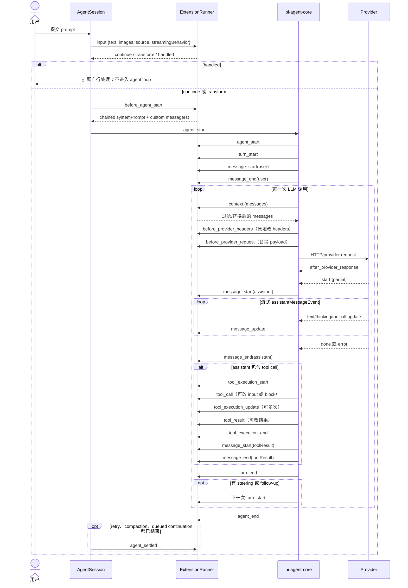

# Pi 扩展事件、生命周期与上下文边界

## 先读这几条

- **目标版本：Pi 0.85.1。** 本机全局安装包的版本号见 `package.json:3`。
- **证据路径前缀：** 本文中以 `dist/...`、`docs/...`、`examples/...` 开头的路径，都相对于
  `/opt/homebrew/lib/node_modules/@earendil-works/pi-coding-agent/`。`pi-ai` 的类型路径因此写作
  `node_modules/@earendil-works/pi-ai/dist/...`。
- **证据等级：** `[官方文档]` 是安装包 `docs/*.md` 的声明；`[代码观察]` 是同一安装包的
  `dist/` 实现；`[运行时观察]` 是实际启动 Pi 或 faux provider 后看到的行为；`[Unverified]`
  只用于当前证据不能决定的边界，并同时说明缺什么。
- **与 API 参考的分工：** 本文回答“**什么时候**能介入，以及介入后**什么会进入模型上下文**”；
  API 的注册方法、工具、UI、渲染器参数和完整能力索引见 [`./pi-extension-api.md`](./pi-extension-api.md)。
- 仓库自己的 `node_modules` 是 0.75.3，不能用来推断本文版本。尤其 `registerEntryRenderer()`、
  `registerMarkdownTransformer()` 等本文提到的能力以 0.85.1 全局安装为准；它们在本版本声明于
  `dist/core/extensions/types.d.ts:964-969`。

## 1. 一轮对话的真实时序

下面把三种容易混淆的“消息”分开：用户消息有自己的 `message_start/message_end`；助手流式响应有
`message_start/message_update/message_end`；工具结果又会产生一对 `message_start/message_end`。`context`
是**每一次普通 provider 调用**之前的 AgentMessage 变换点，不是只在一轮开始时调用一次。

[代码观察] `runAgentLoop()` 先发 `agent_start`、`turn_start`，再发 prompt 的
`message_start/message_end`，然后进入 `runLoop()`；`runLoop()` 在每次 provider 调用前执行
`transformContext`，在工具批次后执行 `turn_end`，最后才是 `agent_end`：
`node_modules/@earendil-works/pi-agent-core/dist/agent-loop.js:43-70,78-171,176-253`。
Pi 将这些低层事件映射到扩展事件并在 `_handleAgentEvent()` 中先调用扩展、再持久化消息：
`dist/core/agent-session.js:360-428,467-557`。

[代码观察] `input` 与 `before_agent_start` 在建立 agent prompt 前发生：
`dist/core/agent-session.js:839-852,914-949`。`context`、provider 请求/响应 hook 的绑定在
`dist/core/sdk.js:177-232`；因此 `context` 每次 provider call 都会触发，而不是一个 session 只触发一次。

## 2. `pi.on()` 事件全表

### 2.1 表的读法

- **结果能否改变行为**只描述宿主实际消费的返回值；没有结果消费的 handler 即使写了
  `return` 也不会改变 Pi。
- “逐 handler `await`”表示 `ExtensionRunner` 在同一个事件内按顺序等待每个 handler；“发射方不等”
  表示调用方用 `void`、`queueMicrotask` 或其他 fire-and-forget 方式启动 runner，事件 handler 内部仍会
  被 runner `await`。
- 所有 handler 的 TypeScript 返回类型首先由
  `ExtensionHandler<E, R> = Promise<R | void> | R | void` 给出：`dist/core/extensions/types.d.ts:901-902`。
- 36 个重载逐字列于 `dist/core/extensions/types.d.ts:907-942`。下表一行对应一个重载，不把
  `ToolCallEvent` 的内部分支误算成多个事件。

### 2.2 启动、资源和 session 事件

| 事件（`pi.on` 名称） | payload 关键字段 | 返回值是否改变行为；同步/异步是否被 await | 典型用法 | 类型与实现证据 |
|---|---|---|---|---|
| `project_trust` | `cwd`；ctx 是受限 trust context | **是**：必须返回 `{ trusted: "yes" \| "no" \| "undecided", remember? }`；第一个 yes/no 决策获胜，`undecided` 放行后续 handler/内置流程。每个 handler **await**；异常收集后继续下一个 handler。 | 在项目资源加载前做安全确认；无 UI 时不要调用对话框。 | `types.d.ts:387-402`；`runner.js:60-87`；官方行为 `docs/extensions.md:351-368` |
| `resources_discover` | `cwd`、`reason: "startup" \| "reload"` | **是**：返回的 `skillPaths`、`promptPaths`、`themePaths` 按扩展和 handler 顺序**累加**。每个 handler **await**，异常隔离。 | 在 `session_start` 后增加扩展专属 skills/prompts/themes。 | `types.d.ts:403-414`；`runner.js:935-971`；`docs/extensions.md:370-386` |
| `session_start` | `reason: "startup" \| "reload" \| "new" \| "resume" \| "fork"`，以及替换 session 时的 `previousSessionFile?` | **否**：返回值忽略；普通 `emit`，每个 handler **await**，session 启动/重载路径也等待 runner 完成。 | 建立 session-scoped 状态、恢复 `custom` entry、启动 watcher。 | `types.d.ts:415-422,909`；`agent-session.js:1925-1927,2236-2239`；官方 `docs/extensions.md:393-403` |
| `session_info_changed` | `name: string \| undefined` | **否**：返回值忽略；`agent-session.js:2453-2455` 用 `void runner.emit(...)`，所以**发射方不等**。 | 更新标题、外部 session 索引或状态栏。 | `types.d.ts:423-428,910`；`agent-session.js:2453-2455` |
| `session_before_switch` | `reason: "new" \| "resume"`、`targetSessionFile?` | **是**：`{ cancel?: boolean }`（`types.d.ts:850-852`）；任一 handler 返回 `cancel` 就立即取消，其他 truthy 结果按 runner 规则替换当前结果。handler **await**。 | 切换/新建 session 前保存或确认外部状态。 | `types.d.ts:429-434,850-852,911`；`agent-session-runtime.js:78-88,128-145`；`docs/extensions.md:416-433` |
| `session_before_fork` | `entryId`、`position: "before" \| "at"` | **是**：`{ cancel?: boolean, skipConversationRestore?: boolean }`（`types.d.ts:853-856`）；`cancel` 立即结束，handler **await**。`skipConversationRestore` 是声明的保留控制位，当前只应按类型使用。 | `/fork`/`/clone` 前确认或保存代码检查点。 | `types.d.ts:435-440,853-856,912`；`agent-session-runtime.js:90-100,174-228`；示例 `examples/extensions/git-checkpoint.ts:29-47` |
| `session_before_compact` | `preparation`、`branchEntries`、`customInstructions?`、`reason: "manual" \| "threshold" \| "overflow"`、`willRetry`、`signal` | **是**：返回 `{ cancel?: boolean, compaction?: CompactionResult }`。`cancel` 取消；`compaction` 是**整个**替代 summary，不是字段级 patch。多个 handler 的 truthy 返回按 runner 规则保留最后一个，handler **await**。 | 自定义摘要、使用另一模型压缩、在 overflow retry 前尊重 `signal`。 | `types.d.ts:441-452,857-860,913`；`agent-session.js:1495-1534,1757-1808`；官方 `docs/compaction.md:273-311` |
| `session_compact` | `compactionEntry`、`fromExtension`、`reason`、`willRetry` | **否**：返回值忽略；摘要已写入 session 并重建 agent context 后发射，handler **await**。 | 记录摘要遥测、同步外部索引。 | `types.d.ts:453-462,914`；`agent-session.js:1539-1553,1826-1840` |
| `session_compact_failed` | `reason`、`errorMessage?`、`aborted`、`willRetry`、`fromExtension` | **否**：返回值忽略；失败/取消路径中 **await**。 | 将手动失败、阈值失败和 overflow recovery 失败统一记账。 | `types.d.ts:463-476,915`；`agent-session.js:325-328,1574-1594,1867-1888`；`docs/compaction.md:351-364` |
| `session_shutdown` | `reason: "quit" \| "reload" \| "new" \| "resume" \| "fork"`、`targetSessionFile?` | **否**：返回值忽略；宿主在 teardown 前 **await** 完所有 handler。 | 释放 timer、watcher、socket、子进程和在途请求；保存必须保留的外部状态。 | `types.d.ts:477-483,916`；`runner.js:49-58`；`agent-session-runtime.js:102-113`；官方 `docs/extensions.md:516-526` |
| `session_before_tree` | `preparation`（target/old leaf/common ancestor/待摘要 entries 等）、`signal` | **是**：`{ cancel?, summary?, customInstructions?, replaceInstructions?, label? }`；`cancel` 立即取消，其余结果交给 tree 导航；handler **await**。 | `/tree` 前拒绝导航或提供自己的 branch summary。 | `types.d.ts:484-503,917,861-874`；`agent-session.js:2488-2533`；`docs/compaction.md:366-396` |
| `session_tree` | `newLeafId`、`oldLeafId`、`summaryEntry?`、`fromExtension?` | **否**：返回值忽略；新 leaf、可选 summary 已写入并重建 context 后 **await**。 | 刷新 branch-aware UI 或外部索引。 | `types.d.ts:504-512,918`；`agent-session.js:2614-2626` |

### 2.3 上下文、provider 和 agent 事件

| 事件 | payload 关键字段 | 返回值是否改变行为；同步/异步是否被 await | 典型用法 | 类型与实现证据 |
|---|---|---|---|---|
| `context` | `messages: AgentMessage[]` | **是**：返回 `{ messages?: AgentMessage[] }`；`messages` 是 runner 从输入做的 `structuredClone`，每个 handler 看到前一个 handler 的结果；handler **await**。只影响这次普通 provider call。 | 删除大型旧结果、注入短期上下文、按模型裁剪消息。 | `types.d.ts:513-517,814-816,919`；`runner.js:791-818`；`sdk.js:227-232` |
| `before_provider_request` | `payload: unknown`（provider 已序列化 payload） | **是**：返回任意非 `undefined` 值替换 payload；多个 handler 链式传递最后 payload；handler **await**。 | 调试/修改 provider-level JSON，如 temperature 或 system 字段。 | `types.d.ts:518-522,817,920`；`runner.js:820-850`；`sdk.js:208-214`；官方 `docs/extensions.md:705-720` |
| `before_provider_headers` | `headers: ProviderHeaders` | **是，但不是 return**：必须原地增删改 `event.headers`；return 被忽略，`null` 删除 header；每个 handler **await**。 | 注入 trace/session header、删除 attribution header。 | `types.d.ts:523-531,921`；`runner.js:852-879`；`sdk.js:200-205`；`docs/extensions.md:687-703` |
| `after_provider_response` | `status`、规范化 `headers` | **否**：返回值忽略；响应收到、body 尚未消费时逐 handler **await**。 | 记录 429、provider 响应头或传输遥测。 | `types.d.ts:532-537,922`；`sdk.js:215-224`；`docs/extensions.md:722-736` |
| `before_agent_start` | `prompt`、`images?`、当前链式 `systemPrompt`、`systemPromptOptions` | **是**：返回 `message?`（加入本轮 custom message）和/或 `systemPrompt?`（下一个 handler 继续看到）；handler **await**。message 会进入 session/context。 | 按当前 prompt 注入持久 custom message，或只改本轮 system prompt。 | `types.d.ts:538-549,845-849,923`；`runner.js:881-934`；`agent-session.js:914-939` |
| `agent_start` | 无额外字段 | **否**：返回值忽略；低层 agent loop 开始前逐 handler **await**。 | 重置一轮状态、开始 turn 遥测。 | `types.d.ts:550-553,924`；`agent-session.js:467-475` |
| `agent_end` | 本次低层 run 的 `messages` | **否**：返回值忽略；`agent_end` handler **await**，但它后面仍可能有 retry/compaction/queued continuation。 | 记录一次低层 run；不要把它当最终 idle 信号。 | `types.d.ts:554-558,925`；`agent-session.js:473-475,787-810`；官方 `docs/extensions.md:567-581` |
| `agent_settled` | 无额外字段 | **否**：返回值忽略；在 Pi 确定没有自动 retry、compaction retry 或 queued continuation 后 **await**。 | 清空一轮完整 run 的临时状态、发送“真正空闲”通知。 | `types.d.ts:559-562,926`；`agent-session.js:347-355`；示例 `examples/extensions/git-checkpoint.ts:49-52` |
| `ui_prompt_start` | `reason: "ui_prompt"`、`kind`、`title?` | **否**；只通知，不应阻塞 UI。事件通过 `queueMicrotask` 后 `void runner.emit`，所以**发射方不等**；嵌套 prompt 合并为外层 span。 | RPC/宿主状态显示“等待用户”。 | `types.d.ts:563-570,927`；`runner.js:283-313`；官方 `docs/extensions.md:583-599` |
| `ui_prompt_end` | 同上 | **否**；同样 fire-and-forget；外层 prompt 结束时发出。 | 结束“等待用户”状态。 | `types.d.ts:571-577,928`；`runner.js:289-313` |
| `turn_start` | `turnIndex`、`timestamp` | **否**：返回值忽略；每个 turn 开始时 **await**。一个 agent run 可以有多个 turn。 | 建立 turn checkpoint 或显示工作阶段。 | `types.d.ts:578-583,929`；`agent-session.js:476-483`；`agent-loop.js:88-110` |
| `turn_end` | `turnIndex`、最后 assistant `message`、`toolResults` | **否**：返回值忽略；工具结果已完成、扩展 handler **await**，然后 Pi flush pending custom messages。 | 统计一轮工具结果、按阈值触发 `ctx.compact()`。 | `types.d.ts:584-590,930`；`agent-session.js:484-492,420-427`；示例 `examples/extensions/trigger-compact.ts:27-41` |

### 2.4 消息、工具、模型和输入事件

| 事件 | payload 关键字段 | 返回值是否改变行为；同步/异步是否被 await | 典型用法 | 类型与实现证据 |
|---|---|---|---|---|
| `message_start` | `message: AgentMessage`（user/assistant/toolResult） | **否**：返回值忽略；逐 handler **await**。 | 创建流式展示或记录消息开始。 | `types.d.ts:591-595,931`；`agent-session.js:494-500`；`agent-loop.js:199-206,51-54` |
| `message_update` | `message`（assistant 当前 partial）、`assistantMessageEvent` | **否**：返回值忽略；每个 stream update 逐 handler **await**。 | 消费 thinking/text/tool-call 增量，更新外部 UI；不能用 return 改 agent message。 | `types.d.ts:596-601,932`；`agent-session.js:501-507`；示例 `extensions/thinking-translator.ts:99-102` |
| `message_end` | `message: AgentMessage`（最终消息） | **是**：可返回 `{ message }`，但 role 必须与当前消息相同；多个 handler 链式替换，宿主把最终对象原地同步回 agent state 后再落盘；handler **await**。 | 修正 usage、补 details 或替换同 role 的最终 content。 | `types.d.ts:602-606,841-844,933`；`runner.js:654-692`；`agent-session.js:509-526` |
| `tool_execution_start` | `toolCallId`、`toolName`、`args` | **否**：返回值忽略；工具执行前逐 handler **await**。 | 显示 pending tool、记录执行开始。 | `types.d.ts:607-613,934`；`agent-session.js:528-536`；`agent-loop.js:261-269,293-303` |
| `tool_execution_update` | `toolCallId`、`toolName`、`args`、`partialResult` | **否**：返回值忽略；每次 partial update 逐 handler **await**；并行工具时 update 可交错。 | 显示长时间工具的增量输出。 | `types.d.ts:614-621,935`；`agent-session.js:537-546`；`agent-loop.js:460-477` |
| `tool_execution_end` | `toolCallId`、`toolName`、`result`、`isError` | **否**：返回值忽略；每个工具 finalize 后 **await**。 | 收起 pending 状态或记录耗时。 | `types.d.ts:622-629,936`；`agent-session.js:547-556`；`agent-loop.js:532-539` |
| `model_select` | `model`、`previousModel?`、`source: "set" \| "cycle" \| "restore"` | **否**：返回值忽略；模型切换路径 **await**，可在 model 生效前后做初始化。 | 切换 provider-specific status 或重建模型缓存。 | `types.d.ts:630-637,937`；`agent-session.js:1237-1248,1269-1270`；`docs/extensions.md:738-759` |
| `thinking_level_select` | `level`、`previousLevel` | **否**：返回值忽略；`agent-session.js:1371-1377` 用 `void runner.emit`，因此**发射方不等**。 | 更新 thinking 状态栏。 | `types.d.ts:638-643,938`；`agent-session.js:1368-1377`；官方 `docs/extensions.md:761-774` |
| `tool_call` | `toolCallId`、`toolName`、可变 `input` | **是**：原地改 `event.input` 会改实际执行参数；return `{ block?, reason?, terminate? }` 控制阻止和终止提示；多个 handler 链式看到前面 mutation，`block` 立即短路。handler **await**。 | permission gate、路径保护、补充 bash 环境变量。 | `types.d.ts:678-724,818-827,939`；`runner.js:745-763`；`agent-session.js:223-243`；示例 `examples/extensions/permission-gate.ts:13-32` |
| `tool_result` | `toolCallId`、`toolName`、`input`、`content`、`details`、`isError`、`usage?` | **是**：可返回局部 patch `{ content?, details?, isError?, usage? }`；后一个 handler 看到前一个 patch；handler **await**。 | 清洗输出、附加嵌套模型 usage、把错误结果转成可读内容。 | `types.d.ts:725-771,835-840,940`；`runner.js:693-744`；`agent-session.js:244-271`；官方 `docs/extensions.md:842-875` |
| `user_bash` | `command`、`excludeFromContext`、`cwd` | **是**：首个 truthy `{ operations? \| result? }` 被消费；`operations` 替换执行后端，`result` 完全接管执行；handler **await**，异常隔离。 | 将 `!`/`!!` 命令路由到远端或直接返回结果。 | `types.d.ts:644-653,828-834,941`；`runner.js:764-790`；interactive 调用 `interactive-mode.js:5455-5470`；RPC 调用 `rpc-mode.js:441-459` |
| `input` | 原始 `text`、`images?`、`source: "interactive" \| "rpc" \| "extension"`、`streamingBehavior?` | **是**：`continue` 放行，`transform` 链式改 text/images，`handled` 首个命中即短路并跳过 agent；handler **await**。 | 输入别名、即时命令、steering 时跳过昂贵预处理。 | `types.d.ts:654-677,942`；`runner.js:973-1009`；`agent-session.js:839-852`；示例 `examples/extensions/input-transform.ts:15-42` |

## 3. 流式输出的真实形状

### 3.1 `AssistantMessageEvent` 的完整联合类型

`message_update.assistantMessageEvent` 的静态类型不是一个只有 `delta` 的对象，而是
`@earendil-works/pi-ai` 的以下 12 个 variant：

| `type` | 事件时字段 | 语义 |
|---|---|---|
| `start` | `partial: AssistantMessage` | 流开始；后续 update 和终止事件都必须在它之后。 |
| `text_start` | `contentIndex`、`partial` | 创建 text block；此时该 block 可为空。 |
| `text_delta` | `contentIndex`、`delta`、`partial` | text 增量；`delta` 只是本次新增字符串。 |
| `text_end` | `contentIndex`、`content`、`partial` | text block 结束；`content` 是该 block 的**全量**最终字符串。 |
| `thinking_start` | `contentIndex`、`partial` | 创建 thinking block；通常尚无增量。 |
| `thinking_delta` | `contentIndex`、`delta`、`partial` | thinking 增量；`delta` 只是本次新增字符串。 |
| `thinking_end` | `contentIndex`、`content`、`partial` | thinking block 结束；`content` 是该 block 的**全量**最终字符串。 |
| `toolcall_start` | `contentIndex`、`partial` | 创建 tool-call block；起始 arguments 形状由 provider 决定。 |
| `toolcall_delta` | `contentIndex`、`delta`、`partial` | tool-call JSON 的后续增量。 |
| `toolcall_end` | `contentIndex`、`toolCall`、`partial` | tool-call block 结束；`toolCall` 是完整工具调用。 |
| `done` | `reason: "stop" \| "length" \| "toolUse" \| "deferred"`、`message` | 正常终止；`message` 是最终 `AssistantMessage`。 |
| `error` | `reason: "aborted" \| "error"`、`error: AssistantMessage` | 错误/取消终止；`error` 是承载终止信息的 assistant message。 |

证据是本机 pi-ai 的联合声明和协议注释：
`node_modules/@earendil-works/pi-ai/dist/types.d.ts:394-463`。

关键边界：

1. `contentIndex` 是 content block 的索引；同一 assistant 消息可以有多个 thinking/text/tool-call block，
   不能用一个全局字符串代替它。
2. `partial` 是共享的“截至目前的 response-so-far”对象，不是每个事件都独立冻结的快照；`*_start`
   产生空 block，`*_delta` 逐步增长，`*_end.content` 才是该 block 的权威全量值。redacted thinking
   可以在 start 时已经完整而没有 delta。
3. `delta` 是增量；`text_end.content`、`thinking_end.content` 是全量，不能把 end 的 content 再当增量拼接。
4. `done` 或 `error` 都是终止信号。Agent loop 在两者任一到达时取得 `response.result()`，发出
   `message_end`，并把最终消息写回 agent state：`node_modules/@earendil-works/pi-agent-core/dist/agent-loop.js:197-252`。
5. `message_update` 只描述助手流；用户、toolResult 没有 assistant stream event。

### 3.2 仓库中的消费例子

仓库 `extensions/thinking-translator.ts:369-450` 是一个不改写原消息的真实消费者：

- `start` 增加 assistant serial 并清空旧 block 状态（`:376-379`）；`done/error` 清理状态（`:381-384`）。
- `thinking_delta` 读取 `event.delta` 并累加，`thinking_end` 读取 `event.content` 覆盖为权威全量（`:409-423`）。
- `contentIndex` 被拼进 block key，区分一条 assistant 消息里的多个 block（`:433-449`）。
- handler 只消费 `event.assistantMessageEvent`，不通过 `message_update` return 改 agent message：
  `extensions/thinking-translator.ts:99-102`。

这是“观察流式数据并另行展示”的正确边界；如果扩展想更新自己返回的 UI 组件，应让组件的
`render()` 读取可变状态，并在需要时显式请求重绘，而不是期待 renderer 工厂再次被调用。

## 4. Session entry：落盘、context 和摘要边界

### 4.1 先区分三层

1. **JSONL entry 层：** `SessionManager` 是 append-only tree；entry 有 `id`、`parentId`、ISO `timestamp`。
   `getEntries()` 返回 entry，但不等于 LLM 会看到它：`dist/core/session-manager.js:991-997`。
2. **active branch/context-entry 层：** `buildContextEntries()` 沿当前 leaf 取路径；遇到最新
   compaction 时保留 summary entry、`firstKeptEntryId` 之后的保留区间和之后的新 entry：
   `dist/core/session-manager.js:191-225`。
3. **LLM message 层：** `buildSessionContext()` 把选中的 entry 投影为 AgentMessage；
   `sessionEntryToContextMessages()` 明确对普通 `custom` 返回空数组：
   `dist/core/session-manager.js:162-188,232-236`。随后 `convertToLlm()` 才把 AgentMessage 转成
   provider 可接受的消息：`dist/core/messages.js:68-122`。

普通持久化 session 下 `_persist()` 会把 entry 写到 JSONL；在首个 assistant message 到来前，尚未
flush 的 entry 可能暂留内存，assistant 到来时一次性写出。`--no-session`/in-memory session 没有
session file：`dist/core/session-manager.js:739-774`。因此下表“落盘”均指**持久化 session**。

### 4.2 Entry 类型总表

| entry `type` | 谁产生 / 典型形状 | 是否落盘 JSONL | 普通 LLM context | compaction / branch summary 输入 | 能否过滤、隐藏或定位 | 证据 |
|---|---|---|---|---|---|---|
| `session`（header，非 `SessionEntry`） | `SessionManager` 创建 session header；含 `version`、session id、cwd、可选 parent session | 是持久化文件第一行；不属于 tree | 否 | 否 | 只影响 session 元数据；不是 active branch 节点 | `session-manager.d.ts:5-12`；官方 `docs/session-format.md:189-201` |
| `message` | Agent 的 user/assistant/toolResult；`bashExecution` 也以 `message` entry 保存。`message_end` 持久化 user/assistant/toolResult，bash 由 `recordBashResult()` 保存 | 是；`appendMessage()` 创建 `type: "message"` | 是；`sessionEntryToContextMessages()` 返回 `entry.message`。`toolResult` 在普通 context 保留，但 branch summary 会特意跳过它 | compaction：按 context projection 参加摘要；branch summary：普通 `message` 参加，但 `toolResult` 在 `branch-summarization.js:63-69` 被跳过（工具上下文已经在 assistant tool call 中） | 通过 active branch、compaction cut point、`context` hook（仅普通 provider call）过滤；最终 assistant 可由 `message_end` 同 role 替换。`bashExecution.excludeFromContext` 还会在 `convertToLlm()` 被过滤 | `agent-session.js:388-400,453-466,2390-2412`；`session-manager.js:166-175,781-790`；`messages.js:19-38,111-121`；`branch-summarization.js:63-69` |
| `custom` | `pi.appendEntry(customType, data)`；运行时绑定写入并发 `entry_appended` | 是；`appendCustomEntry()` 创建 `data` | **否**；projection 直接返回 `[]` | compaction：不进入 `messagesToSummarize`；branch summary：显式排除 `custom` | 可按 `customType` 扫描恢复；interactive 只有注册 matching entry renderer 才显示；不参与 model input | `types.d.ts:968-969,984-985`；`agent-session.js:2029-2034`；`session-manager.js:834-845`；`session-manager.js:166-188`；`branch-summarization.js:76-82`；官方 `docs/session-format.md:263-271` |
| `custom_message` | `pi.sendMessage()`，或 `before_agent_start` 返回 `message` 后由 session 写入 | 是；`appendCustomMessageEntry()` 创建 `content/display/details` | **是**：先投影为 role `custom`，再由 `convertToLlm()` 变成 provider 的 role `user`。`display: false` 只影响 TUI，不影响 context | compaction：通过 `sessionEntryToContextMessages()` 参加；branch summary：`getMessageFromEntry()` 转成 CustomMessage 后参加 | 可由 `display` 隐藏 TUI；可由 `context` hook 在普通 provider call 过滤；不能靠 `display:false` 防止送入模型；按 `customType` 过滤历史 | `agent-session.js:1087-1138`；`session-manager.js:177-180,874-893`；`messages.js:89-95`；官方 `docs/session-format.md:273-284` |
| `compaction` | `/compact`、阈值或 overflow recovery；扩展可在 `session_before_compact` 提供 summary | 是；`appendCompaction()` 创建 `summary/firstKeptEntryId/tokensBefore/details/usage/fromHook` | 是：投影为 `compactionSummary`，`convertToLlm()` 序列化成 role `user` 的 summary 文本；同时决定旧 entries 的保留边界 | 当前 compaction entry 不作为同一次 compaction 的正文重复抽取；旧 summary 作为下一次 compaction 的 `previousSummary`；branch summary 把 compaction 转成 summary message | 可通过 compaction 边界淘汰旧消息；可由 `session_before_compact` cancel 或整体替代；不能用 `context` hook 改写默认 compaction 的 source messages | `agent-session.js:1495-1553,1826-1840`；`session-manager.js:185-186,817-832`；`compaction.js:46-50,517-538`；`branch-summarization.js:72-75` |
| `branch_summary` | `/tree` 导航时由默认或 extension summary 生成；`branchWithSummary()` 写入 | 是；含 `fromId/summary/details/usage/fromHook` | 是：投影为 `branchSummary`，然后是 role `user` 的 summary 文本 | compaction：作为当前 context message 参加；branch summary：旧 branch summary 也可被 `getMessageFromEntry()` 投影 | 可选择 `/tree` 不做 summary；`session_before_tree` 可 cancel/替换 summary；entry 的 `details` 不送 provider | `agent-session.js:2590-2600`；`session-manager.js:182-184,1064-1086`；`branch-summarization.js:70-75`；`messages.js:97-102` |
| `label` | `/tree`、`pi.setLabel()`/`appendLabelChange()`；指向别的 entry 的 bookmark | 是；含 `targetId/label`，清除标签也追加 entry | 否 | 否；branch summary 显式排除 | 可以按 tree filter（default/no-tools/user-only/labeled-only/all）显示；不改变模型输入 | `session-manager.js:926-951`；官方 `docs/sessions.md:87-100`、`docs/session-format.md:286-295` |
| `model_change` | `/model`、model cycle、session restore；`appendModelChange()` | 是 | 不产生 message；但 `buildSessionContext()` 从完整 active path 读取最后模型设置 | 不作为摘要正文 | 通过 branch path 选择生效设置；切换事件可观测但不能用 return veto | `session-manager.js:146-160,804-816`；`agent-session.js:1237-1270`；官方 `docs/session-format.md:213-219` |
| `thinking_level_change` | thinking level 设置、keybinding、`pi.setThinkingLevel()`；`appendThinkingLevelChange()` | 是 | 不产生 message；`buildSessionContext()` 从完整 path 读取 level | 不作为摘要正文 | 通过 branch path 选择生效 level；用 `thinking_level_select` 做通知而非 veto | `session-manager.js:146-155,792-802`；`agent-session.js:1368-1377`；官方 `docs/session-format.md:221-227` |
| `session_info` | `/name`、启动 name、`pi.setSessionName()`；`appendSessionInfo()` | 是 | 否 | 否 | 只影响 session selector 名称；空 name 清除 | `session-manager.js:847-871`；官方 `docs/session-format.md:296-304` |

[代码观察] 普通 `custom` 和 `custom_message` 的名字相似但边界相反：
`sessionEntryToContextMessages(custom)` 是 `[]`，而 `custom_message` 是 Agent role `custom`；
`convertToLlm()` 对 role `custom` 输出 role `user`。所以“持久化”绝不自动等于“污染模型”，而
`display: false` 也绝不等于“不进模型”。

[代码观察] 默认 compaction 和 branch summary 使用自己的 entry 投影、`convertToLlm()` 和文本
序列化；它们不是普通 agent provider call，因此默认 compaction 不经 `emitContext()`：
`dist/core/compaction/compaction.js:488-506`、`dist/core/compaction/branch-summarization.js:187-226`。
要改变摘要边界，应使用 `session_before_compact` / `session_before_tree`，而不是假定 `context`
handler 会拦住摘要请求。当前代码对摘要 provider 是否触发某些底层 provider transport hook 不在
本文作额外推断；需要针对 provider 实现逐一验证（**Unverified**）。

## 5. “展示但不污染上下文”的四条路线

下表把“持久化”“是否进入模型”“位置”“刷新”放在一起。想保存可恢复状态但不让模型看到，首选
`appendEntry` + `registerEntryRenderer`；只想显示瞬时状态，首选 widget/status；不要把
`sendMessage` 当成 UI-only API。

| 路线 | 持久化 | context / compaction | interactive 位置 | 刷新与限制 |
|---|---|---|---|---|
| `ctx.ui.setWidget(key, content, options)` | 否；TUI runtime UI 状态，不写 session JSONL | 不进 session、context 或 compaction/branch summary | 默认 `aboveEditor`，可用 `belowEditor`；由 interactive 的 `setExtensionWidget()` 按 placement 放入两个 widget container：`dist/modes/interactive/interactive-mode.js:1695-1729` | `setWidget()` 最终 `renderWidgets()` 并 `requestRender()`：`dist/modes/interactive/interactive-mode.js:1775-1782`。字符串数组可直接替换；factory 只负责建立 component，流式内容应让 component `render()` 读取可变状态。RPC 只支持字符串数组请求，factory 被忽略：`dist/modes/rpc/rpc-mode.js:123-136`。 |
| `pi.appendEntry()` + `registerEntryRenderer()` | 是 `custom` JSONL entry；`appendEntry()` 公共 API 返回 `void`，没有 entry id/anchor/update 参数：`dist/core/extensions/types.d.ts:968-985` | `custom` 不进普通 context，也不进 compaction/branch summary：`dist/core/session-manager.js:162-188` | interactive 有 renderer 且 entry appended 时加入 chat；如果正在流式 assistant，插到 streaming assistant 组件**之前**（显示在消息上方）；否则追加到聊天流末尾（消息下方）：`dist/modes/interactive/interactive-mode.js:2895-2913`。 | `appendEntry` 触发宿主 `entry_appended` 和一次 requestRender：`dist/core/agent-session.js:2029-2034`。entry renderer 工厂对一个 entry 只调用一次，返回的 component 每帧 `render()`；因此同一个框内刷可变状态要保留状态并请求 TUI 重绘，而不是再次 append。实现骨架见 `dist/modes/interactive/components/custom-entry.js:12-50`；本仓库已有实测：`live_renderer_created` 每 entry 一次、`live_renderer_render` 同 key 多次。没有内建“更新某条 entry” API。 |
| `pi.sendMessage()` + `registerMessageRenderer()` | 是 `custom_message` JSONL entry；发送 API 返回 `void`。流式期间默认按 `steer`/`followUp` 排队；`triggerTurn:false` 的迟到消息在当前 turn 结束后 flush：`dist/core/agent-session.js:1087-1152` | **进 context**；`display:false` 只隐藏 TUI，仍投影成 role `custom` 并转换为 provider `user`；也会进入默认 compaction/branch-summary 投影。 | interactive 按 message lifecycle 加入聊天流；`display:true` 才建立 message renderer，`display:false` 不显示：`dist/modes/interactive/interactive-mode.js:2925-2932`。 | 正常消息事件和宿主重绘负责刷新；若想 UI-only，不应选择此路线。handler/renderer 不能取得“更新某条消息”的 id；重复 `sendMessage` 就是多条 entry。 |
| `registerMarkdownTransformer()` | 否；只改变 interactive 对普通 user/assistant/thinking Markdown 的展示字符串 | 不改变 session entry、AgentMessage 或 compaction 输入；只在宿主渲染前变换 Markdown | 没有独立位置，结果出现在普通消息/思考块内 | 多个 transformer 按扩展加载顺序链式传递：`docs/extensions.md:1593-1615`、`dist/core/extensions/runner.js:434-435`。它是 render-time 机制，不是状态存储机制；print/RPC 没有 interactive transcript renderer。 |

### 流式刷新陷阱

[运行时观察] 宿主在每个 `message_update` 末尾无条件 `ui.requestRender()`，即使扩展不调用
`ctx.ui.setStatus` 也会刷新：`dist/modes/interactive/interactive-mode.js:2623-2646`。

[运行时观察] 流式结束后扩展才收到的迟到状态更新没有这个内建触发器；要调用
`ctx.ui.setStatus()`（其实现会 `ui.requestRender()`，`dist/modes/interactive/interactive-mode.js:1616-1619`），
或者在自定义组件中保留 `tui` 并调用 `tui.requestRender()`。仓库实现正是这样做的：
`extensions/thinking-translator.ts:539-548`。

## 6. 多扩展共存、结果合并和错误隔离

### Handler 顺序

1. `pi.on()` 在同一个扩展内把 handler `push` 到数组：`dist/core/extensions/loader.js:230-237`。
2. runner 先按扩展加载顺序，再按每个扩展内的注册顺序串行调用，并对每个 handler `await`：
   `dist/core/extensions/runner.js:623-652`。
3. 因此不要假设多个 async handler 并行；后一个 handler 看到的事件/中间结果取决于该事件的合并规则。

### 各类合并规则

- **决策/短路：** `project_trust` 的第一个 yes/no 获胜；`session_before_*` 的任一 `cancel` 立即返回。
  其他 truthy `session_before_*` 结果并非深合并，后一个 truthy result 会替换前一个 result：
  `runner.js:60-87,617-652`。
- **链式替换：** `context` 的 messages、`before_provider_request` 的 payload、
  `before_agent_start` 的 system prompt 都沿 handler 链传递；`before_agent_start` 的 messages 则是
  各 handler 返回项的累积：`runner.js:791-818,820-850,881-934`。
- **链式 patch：** `tool_result` 的四个可选字段逐个覆盖当前值；`message_end` 把当前消息传给
  下一个 handler，并拒绝 role 改变：`runner.js:654-743`。
- **原地修改：** `tool_call.input` 和 `before_provider_headers.headers` 不是通过 return 替换；前者
  影响实际工具参数，后者的 return 完全忽略：`runner.js:745-763,852-879`。
- **首个结果：** `user_bash` 返回首个 truthy result；`tool_call` 则是每个 truthy result 覆盖，
  直到某个 `{ block:true }` 立即短路；`input` 的 `{ action:"handled" }` 立即短路：
  `runner.js:745-790,973-1009`。
- **累加：** `resources_discover` 的每个路径数组追加到总结果，而不是去重或覆盖：
  `runner.js:935-971`。

### 异常

[官方文档] 一般扩展错误会记录并继续；`tool_call` 错误按 fail-safe 阻止工具：
`docs/extensions.md:2922-2926`。

[代码观察] 普通 `runner.emit()` handler 的异常会走 `emitError()`，当前 handler 失败但后续 handler
继续：`dist/core/extensions/runner.js:631-650`、`dist/core/extensions/runner.js:407-415`。
`message_end`、`tool_result`、`user_bash`、`context`、`before_provider_request`、
`before_provider_headers`、`before_agent_start`、`resources_discover`、`input` 都有相应的局部
try/catch 路径。

[代码观察] `tool_call` 的 `emitToolCall()` 本身没有 try/catch：`dist/core/extensions/runner.js:745-763`。
上层 `AgentSession` 会把该异常重新抛给 agent-core 的 `prepareToolCall()`，后者将它变成 error
`toolResult`，而不是让整个 agent loop 崩溃：`dist/core/agent-session.js:223-243`、
`node_modules/@earendil-works/pi-agent-core/dist/agent-loop.js:400-458`。因此不能把“runner 的
所有事件都统一 emitError 隔离”写成事实；`tool_call` 是特殊 fail-safe 路径。

### Renderer 冲突

- `messageRenderer`：同一 `customType` 按扩展顺序找，**第一个**命中的 renderer 获胜：
  `dist/core/extensions/runner.js:425-432`。
- `entryRenderer`：规则相同，**第一个**命中的 renderer 获胜：
  `dist/core/extensions/runner.js:437-445`。
- 同一个扩展重复注册同一 `customType` 时，其 Map 的后一次 `set()` 覆盖前一次：
  `dist/core/extensions/loader.js:274-285`。
- Markdown transformer 不竞争同一个 slot；所有扩展 transformer 按顺序组成链：
  `dist/core/extensions/runner.js:434-435`。

## 7. 生命周期、清理和 reload

### Session 生命周期

`session_start.reason` 的完整取值是：

- `startup`：进程首次启动 session；
- `reload`：`/reload` 或 `ctx.reload()` 后同一 session runtime 重新绑定；
- `new`：`/new`；
- `resume`：`/resume`/切换到已有 session；
- `fork`：`/fork` 或 `/clone` 产生的新 session。

声明和 `previousSessionFile` 规则见 `dist/core/extensions/types.d.ts:415-422`，官方说明见
`docs/extensions.md:393-403`。成功替换 session 的实际顺序是：先等待旧 session abort，再发旧
`session_shutdown`，销毁旧 runtime，创建并绑定新 runtime，最后发新 `session_start`：
`dist/core/agent-session-runtime.js:102-145,147-172,174-228`。

`session_shutdown.reason` 的完整取值是 `quit`、`reload`、`new`、`resume`、`fork`；替换目标
路径在 `targetSessionFile?`。声明见 `dist/core/extensions/types.d.ts:477-483`，实际 teardown
见 `dist/core/agent-session-runtime.js:102-113`。

### `/reload` 的行为

[官方文档] `await ctx.reload()`：

1. 对当前 extension runtime 发 `session_shutdown`；
2. 重新加载 extensions、skills、prompts、themes、context files；
3. 发 `session_start { reason: "reload" }` 和 `resources_discover { reason: "reload" }`；
4. 当前 command 的旧 call frame 会继续执行，但旧 `pi`/旧 session-bound context 已失效；
5. 未来 command/event/tool call 使用新 extension instance。

证据：`docs/extensions.md:1303-1325`、`dist/core/agent-session.js:2219-2238`。可预测的写法是
`await ctx.reload(); return;`，不要在 reload 后继续用旧内存状态。

### timer、watcher 和在途请求的释放位置

官方规则是：factory 可能在从不启动 session 的调用中运行，因此不要在 factory 顶层启动
process/socket/file watcher/timer；在 `session_start` 或真正需要它的 command/tool/event 中启动，
在幂等的 `session_shutdown` 中释放：`docs/extensions.md:220-224`。

请求本身应使用 handler 的 `ctx.signal`；compaction/tree event 也提供自己的 `signal`。例如
`thinking-translator` 将翻译 provider stream 绑定到 `ctx.signal`：`extensions/thinking-translator.ts:478-490`，
并在 `session_start`、`agent_start`、`session_shutdown` 清掉展示 epoch、状态 Map 和 timer：
`extensions/thinking-translator.ts:89-107,624-646`。

### 为什么模块级全局变量会“跳车”

`thinking-translator.ts:56-70` 的 Map、序列号、timer 和 TUI 引用都是 module-level state；它们
属于某次 extension module/runtime，而不是 session entry。reload 或 session replacement 会创建新
runtime，新 instance 不会自动接管旧 module 的内存状态；旧 handler 仍可能有在途 Promise，故必须
用 shutdown 清理并用 epoch/AbortSignal 让迟到结果失效。若状态必须跨 reload/resume，应写入
`custom` entry 并在 `session_start` 扫描恢复；若状态只用于本轮展示，就在 shutdown 丢弃。

## 8. 模式差异：interactive、print、RPC

### 8.1 总规则

`ctx.mode` 和 `ctx.hasUI` 的官方矩阵是：

| 模式 | `ctx.mode` | `ctx.hasUI` | 事件 hook | 渲染/UI 能力 |
|---|---|---:|---|---|
| Interactive | `"tui"` | `true` | 完整 agent/session/provider/tool/input 生命周期；用户可触发 `/tree`、`/fork`、`!` 等 UI 路径 | 完整 TUI transcript、widget、entry/message renderer、Markdown transformer、dialogs、custom component |
| Print `-p`（text） | `"print"` | `false` | 扩展仍加载，prompt 仍经历 input/before_agent_start/agent/turn/message/tool/context/provider 等核心路径；没有交互式 editor 事件来源 | 不能 prompt；UI methods 是 no-op；没有 interactive transcript，因此 renderer/widget 没有 TUI 画面 |
| RPC `--mode rpc` | `"rpc"` | `true` | 扩展和 agent 事件仍运行；输入来自 RPC `prompt`，`user_bash` 可由 RPC `bash` 命令触发 | 对话框/通知通过 JSON protocol；`custom()`、factory widget、custom editor/footer/header 和 TUI renderer 不可用或不由 RPC 渲染；字符串 widget 可发 `extension_ui_request` |
| JSON `--mode json`（补充） | `"json"` | `false` | 核心事件会序列化为 JSON event stream | 无 UI；用于机器读取事件，不是 TUI 渲染 |

官方矩阵与 guard 规则见 `docs/extensions.md:2928-2937`。print mode 的代码把 extension runner
绑定为 `print`/`json`，text 模式只输出最终 assistant text，JSON 模式才把 session events 写 stdout：
`dist/modes/print-mode.js:48-95,97-127`。RPC mode 将 session events 通过 `toJsonEvent` 输出，并
把 `ctx.mode` 设为 `rpc`：`dist/modes/rpc/rpc-mode.js:225-270`。

### 8.2 具体限制

- **所有 mode 都能注册事件 handler；** “不可用”通常指触发路径不存在（例如 print 没有 TUI editor），
  不是 `pi.on()` 注册报错。
- **`ctx.hasUI` 不能当作“有 TUI”。** RPC 的 `hasUI` 是 true，但 `ctx.ui.custom()` 返回
  `undefined`，factory widget 被忽略：`dist/modes/rpc/rpc-mode.js:123-155`。需要 TUI component、
  terminal input 或 renderer 时检查 `ctx.mode === "tui"`，这是官方明确要求：`docs/extensions.md:968-974`、
  `docs/extensions.md:2928-2937`。
- **print `-p` 不能等待用户确认。** permission gate 等必须在 `!ctx.hasUI` 分支采取默认策略，
  例子 `examples/extensions/permission-gate.ts:20-23`；否则 handler 不能靠对话框改变行为。
- **RPC 不等于 TUI。** `notify`、`setStatus`、字符串 `setWidget` 可被 RPC host 转成协议消息，但
  host 是否把这些消息画成何种界面属于 host 契约；本文不把它们写成 TUI renderer 已执行。
- **Markdown/entry/message renderer 依赖 interactive transcript。** 这些注册 API 可以在其他 mode
  注册，但当前 print/RPC 代码没有 interactive chat component 消费它们；因此只能观察到核心事件和
  JSON/text 输出，不能期待 renderer 工厂被调用。当前安装包未提供“RPC host 执行 TUI renderer”的路径，
  若要证明某个外部 RPC host 的自定义渲染，需要针对该 host 做端到端实验（**Unverified**）。

## 9. 实用边界清单

1. **只展示、不进模型：** `setWidget`/`setStatus`；若要可恢复且出现在 transcript，用
   `appendEntry` + `registerEntryRenderer`，不要用 `sendMessage`。
2. **进模型但不显示：** `sendMessage({ display: false })` 可以做到“隐藏但仍污染 context”；
   这正是 `custom_message` 的语义，不是 UI-only storage。
3. **只改本次 provider call：** `context`；但不要用它拦截默认 compaction 或 branch summary。
4. **改摘要边界：** `session_before_compact` / `session_before_tree`，返回 cancel 或完整 summary；
   不要把 `compaction` return 当局部 patch。
5. **真正的最终状态点：** `agent_end` 不是最终 idle；需要等自动 retry、compaction 和 queued
   continuation 的 `agent_settled`。
6. **清理：** session-scoped timer/watcher/request 在 `session_shutdown` 释放；新 session 在
   `session_start` 重新建立；reload 后不复用旧 ctx/pi。
7. **并发和顺序：** 同事件 handler 串行 await；工具执行本身可并行，`tool_execution_update` 和
   `tool_execution_end` 会交错，最终 toolResult message 仍按 assistant source order 发出：
   `docs/extensions.md:651-673`。

## 10. 证据覆盖与未验证项

本稿实际读取并交叉核对了：

- `dist/core/extensions/types.d.ts` 的全部事件/结果接口与 36 个 `ExtensionAPI.on()` 重载；
- `dist/core/extensions/runner.js` 的普通 emit、特殊 emit、链式合并、错误隔离和 renderer 查找；
- `dist/core/agent-session.js`、`dist/core/agent-session-runtime.js` 的事件转发、消息排队、
  `sendMessage`/`appendEntry`、session replacement、compaction/tree 生命周期；
- `node_modules/@earendil-works/pi-agent-core/dist/agent-loop.js` 的 turn、steering/follow-up、
  assistant stream 和 tool execution 循环；
- `dist/core/session-manager.js`、`dist/core/session-manager.d.ts`、`dist/core/messages.js`、
  `dist/core/compaction/compaction.js`、`dist/core/compaction/branch-summarization.js`；
- `dist/core/sdk.js` 的 context/provider hook 绑定；
- `node_modules/@earendil-works/pi-ai/dist/types.d.ts` 的 `AssistantMessageEvent` 联合类型；
- 官方 `docs/extensions.md` 的 Events/Lifecycle、State Management、Error Handling、Mode Behavior，
  `docs/sessions.md`、`docs/session-format.md`、`docs/compaction.md`；
- 官方示例 `custom-compaction.ts`、`trigger-compact.ts`、`git-checkpoint.ts`、`bookmark.ts`、
  `event-bus.ts`、`file-trigger.ts`、`permission-gate.ts`、`input-transform.ts`、
  `input-transform-streaming.ts`、`send-user-message.ts`、`handoff.ts`；
- 仓库 `extensions/thinking-translator.ts:56-70,89-107,369-450,478-548,624-646`。

明确标为 **Unverified** 的只有两类：默认摘要请求是否在每个 provider 实现上触发某些底层 transport
hook（本文只证明它绕过 `emitContext`），以及某个外部 RPC host 是否自行执行 TUI renderer。其余
事件、entry 投影、合并和生命周期结论均有本机 0.85.1 `dist`/官方文档行号证据；widget 插入位置、
renderer 创建/重绘次数和流式 requestRender 还由本仓库已有运行时观察支持。
